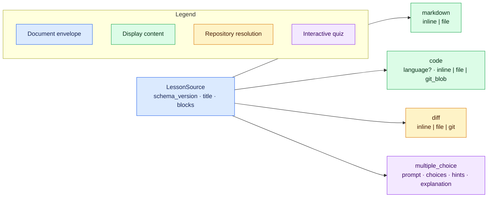

# Authoring v1 lessons

`learnc` accepts one authored JSON document, resolves every referenced resource,
and emits a self-contained `.learn` artifact for `learn`. The format is intended
to be generated by an agent: keep the lesson ordered, explicit, and small enough
for a learner to understand one change at a time.

Use the compiler as the source of truth:

```console
learnc schema --version 1.1.0
learnc check lesson.json
learnc build lesson.json
learn serve lesson.learn
```

Commands emit JSON by default, including `--help`, `--version`, and invalid
usage. Add `--text` or `-t` for human-readable output; use `learnc -t --help`
for the normal Clap help page.
`check` runs the complete parse, validation, repository, Git, and diff pipeline
without writing a `.learn` file. Never edit a generated `.learn` artifact; change
the source or referenced inputs and rebuild it.

## Document shape

The v1 envelope has exactly three fields. Every block requires a unique,
human-readable `id`; IDs are the names diagnostics and future references use.
Do not author numeric node IDs or choice IDs—the compiler generates those.



```json
{
  "schema_version": "1.1.0",
  "title": "Why queue removal changed",
  "blocks": []
}
```

### What the JSON Schema can and cannot prove

`learnc schema` is the exact structural schema for the selected source version.
Source schema `1.1.0` adds the optional code-block `language` field. The
compiler still accepts `1.0.0` documents, but that older closed schema rejects
`language`; use `1.1.0` for language-aware lessons.
It describes the closed object shapes at every nesting level, required fields,
JSON value types, tagged-union alternatives, the minimum two quiz choices, and
the minimum value of one-based line numbers. Unknown fields are rejected both at
the document root and inside blocks, sources, choices, file selectors, and line
ranges.

Some rules depend on relationships between values or on external state and are
therefore enforced only by `learnc check` and `learnc build`. These include:

- non-blank titles, IDs, Markdown, code, prompts, choices, hints, and explanations;
- document-wide source-ID uniqueness;
- exactly one correct choice per question;
- inclusive range ordering (`end >= start`) and ranges fitting resolved content;
- unique and non-empty Git file selections and range/change intersection;
- path ownership, file existence and UTF-8 decoding;
- Git revision resolution, owning-repository boundaries, ignored-file rules,
  and stable repository snapshots;
- parsing inline, file, and generated patches into valid structured diffs.

Passing generic JSON Schema validation is useful but not sufficient. Always run
`learnc check` against the intended repository state before building.

The complete, repository-independent
[`inline-lesson.json`](../examples/inline-lesson.json) demonstrates all four
block types and can be checked directly:

```console
learnc check examples/inline-lesson.json
```

## Markdown and code

Markdown supports inline text or a UTF-8 file below the selected filesystem
root. Raw HTML is not part of the rendering contract. Use Markdown blocks for
all prose that should render as Markdown, including headings, lists, emphasis,
and explanations. Do not put ordinary Markdown prose in a code block: code
blocks intentionally display literal text. A code block should use language
`markdown` only when the lesson is explicitly teaching Markdown syntax, and
then it should contain the smallest useful literal fragment rather than an
entire prose section.

```json
{
  "type": "markdown",
  "id": "overview",
  "source": { "kind": "file", "path": "docs/overview.md" }
}
```

Code supports inline text, a worktree file, or a blob at a Git revision. Its
optional `language` controls syntax presentation. Line ranges are optional,
one-based, inclusive, and must exist in the resolved text.

```json
{
  "type": "code",
  "id": "implementation-at-head",
  "language": "rust",
  "source": {
    "kind": "git_blob",
    "revision": "HEAD~2",
    "path": "src/queue.rs",
    "lines": { "start": 70, "end": 118 }
  }
}
```

The canonical language names are `rust`, `python`, `javascript`, `typescript`,
`c`, `cpp`, `go`, `java`, `shell`, `json`, `yaml`, `toml`, `html`, `css`,
`xml`, `sql`, `markdown`, `mermaid`, and `text`. The accepted aliases normalize
as follows:

| Canonical | Accepted aliases |
| --- | --- |
| `rust` | `rs` |
| `python` | `py` |
| `javascript` | `js`, `jsx`, `mjs`, `cjs` |
| `typescript` | `ts`, `tsx`, `mts`, `cts` |
| `c` | `h` |
| `cpp` | `c++`, `cxx`, `cc`, `hpp`, `hxx`, `hh` |
| `go` | `golang` |
| `shell` | `sh`, `bash`, `zsh`, `fish` |
| `json` | `jsonc` |
| `yaml` | `yml` |
| `html` | `htm` |
| `xml` | `xsl`, `xslt`, `svg` |
| `css` | `scss`, `sass` |
| `markdown` | `md`, `mdx` |
| `mermaid` | `mmd` |
| `text` | `txt`, `plain`, `plaintext` |

`java`, `toml`, and `sql` need no aliases. When `language` is omitted from
a file or Git-blob source, the compiler infers it from the path extension.
Extensionless names such as `Makefile` and `Dockerfile`, and any other
unrecognized path, fall back to plain text. Inline sources have no filename to
inspect, so set `language`
explicitly when highlighting or special rendering matters. An unknown explicit
language also normalizes to `text` instead of making the lesson invalid.

Mermaid is the one code language with semantic rendering: a code block that
resolves to `mermaid` is rendered as a diagram. Author the diagram as an inline
code source rather than a Mermaid fence inside Markdown:

```json
{
  "type": "code",
  "id": "compiler-flow",
  "language": "mermaid",
  "source": {
    "kind": "inline",
    "content": "flowchart LR\n  Source --> Compiler --> Artifact"
  }
}
```

Use `language: "text"` when Mermaid source should be shown literally instead
of rendered as a diagram. If a Mermaid diagram is invalid, the runtime shows
its escaped source instead of injecting a partial rendering.

When color communicates semantic categories, define named `classDef` styles
and assign nodes with `class`. The runtime derives a compact legend from those
definitions, using the semantic class name as its label. Diagrams without
`classDef` styles have no legend. Prefer a few meaningful classes over
decorative `subgraph` containers or one-off node styles.

Paths always use forward slashes and are relative to the selected filesystem
root. Do not use absolute paths, `.` components, or `..`. Agents do not provide
content hashes: the compiler computes them after resolution.

## Diffs

Keep each diff next to the explanation and code it belongs to. A useful local
narrative unit introduces one concept, shows the relevant code when needed,
presents its diff, explains the effect, and optionally asks a follow-up
question. Repeat that shape in authored order rather than stacking unrelated
diffs at the end of the lesson. A final aggregate diff belongs only in a lesson
that explicitly needs one as a recap. The compiler infers each structured diff
file's language from its displayed path and the runtime applies the same syntax
highlighting used for code blocks; diff blocks do not take a separate authored
`language` field.

Use an inline or file source when a patch already exists. Put long patches in a
file instead of reproducing them in lesson JSON.

```json
{
  "type": "diff",
  "id": "authored-patch",
  "source": { "kind": "file", "path": "changes/queue.patch" }
}
```

Prefer a declarative Git source for repository changes. This example compares a
symbolic base with the current worktree and asks for two context lines:

```json
{
  "type": "diff",
  "id": "queue-change",
  "source": {
    "kind": "git",
    "base": "HEAD",
    "target": { "kind": "worktree" },
    "files": [
      {
        "path": "src/queue.rs",
        "after_lines": { "start": 82, "end": 90 }
      }
    ],
    "context_lines": 2
  }
}
```

For a committed comparison, use
`"target": { "kind": "revision", "revision": "main" }`. A `before_lines`
range selects deletions by base-side line number; `after_lines` selects additions
or modifications by target-side line number. A selected range that intersects no
change is an error.

One Git diff block may cover files owned by only one Git repository. Git finds
the nearest owning repository independently for every selected path, so sibling
repositories and submodules are both supported beneath one root. Split paths
with different owners into separate diff blocks. Explicitly selected untracked
worktree files become complete additions; ignored files are rejected.

The compiler invokes Git directly from structured fields. Never place shell
commands or Git argument arrays in the lesson.

## Multiple choice

A multiple-choice block needs at least two Markdown choices and exactly one
`correct: true`. Omitting `correct` means false. Do not give choices IDs.

```json
{
  "type": "multiple_choice",
  "id": "check-order",
  "prompt": "Which operation implements FIFO removal?",
  "choices": [
    { "content": "`pop_front`", "correct": true },
    { "content": "`pop_back`" }
  ],
  "hints": ["FIFO means first in, first out."],
  "explanation": "Removing from the front returns the oldest queued value."
}
```

Hints are public. The correct generated choice ID and explanation are stored in
the artifact's server-owned answer table. An incorrect attempt does not reveal
them; a correct attempt or explicit reveal does.

## Filesystem root, repositories, and freezing

Every authored path is relative to one filesystem root. The root defaults to
the compiler's current working directory and does not itself need to be a Git
repository. Override it when the lesson inputs live elsewhere:

```console
learnc check --root /path/to/workspace lesson.json
learnc build --root /path/to/workspace lesson.json -o queue.learn
```

For Git-backed sources, the compiler asks Git for the nearest owner of each
referenced path. A single lesson can therefore use unrelated repositories such
as `repo-a/src/a.rs` and `repo-b/src/b.rs` under the same selected root.
`HEAD`, branch names, and expressions such as `HEAD~2` are valid source
revisions. A successful build records concrete object IDs, embeds resolved
content and structured diffs, keeps only root-relative paths and owning-repository
provenance, and writes resource hashes. If selected inputs change during
compilation, the build fails instead of emitting a mixed snapshot.

The complete
[`repository-lesson.json`](../examples/repository-lesson.json) demonstrates file,
Git blob, patch-file, selected worktree-diff, and quiz blocks. Because those
sources require committed history plus a deliberate worktree change, create its
complete disposable repository before compiling it:

```console
repository=$(examples/create-repository-lesson.sh)
learnc check --root "$repository" "$repository/lesson.json"
learnc build --root "$repository" "$repository/lesson.json"
learn serve "$repository/lesson.learn"
```

The setup script prints the temporary repository path and leaves it in place for
inspection. Remove that directory when finished. From a source checkout,
`just repository-example` performs the complete setup, check, build, and serve
workflow and removes the temporary repository when the server exits. The
integration test invokes the same setup script, so the documented example and
tested fixture cannot silently diverge.

## Acting on diagnostics

Default failures are stable JSON and may include several independent problems:

```json
{
  "ok": false,
  "diagnostics": [
    {
      "code": "source.id.duplicate",
      "pointer": "/blocks/3/id",
      "message": "source ID `check-order` is already used by another block",
      "related": [
        {
          "pointer": "/blocks/1/id",
          "message": "the source ID was first declared here"
        }
      ],
      "suggestions": ["Give every block a document-unique source ID."]
    }
  ]
}
```

Branch on `code`, locate the authored value with `pointer`, apply a suggestion
only when it preserves the lesson's intent, then run `learnc check` again. The
compiler never repairs malformed source silently.
