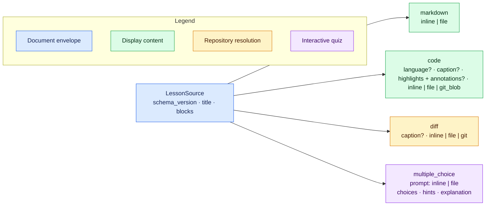

# Authoring v1 lessons

`learnc` accepts one authored JSON document, resolves every referenced resource,
and emits a self-contained `.learn` artifact for `learn`. The format is intended
to be generated by an agent: keep the lesson ordered, explicit, and small enough
for a learner to understand one change at a time.

Use the compiler as the source of truth:

```console
learnc schema --version 2.1.0
learnc check lesson.json
learnc lint lesson.json
learnc build lesson.json
learn serve lesson.learn
```

When the best presentation block is genuinely unclear, `learnpick` can advise
on one teaching unit before authoring it:

```console
learnpick "Explain why this patch fixes the race"
```

Its `markdown`, `code`, `diff`, or `multiple_choice` result is optional guidance,
not schema validation. If it is unavailable or uncertain, choose from the
semantics below and continue; only `learnc schema` and `learnc check` are
authoritative. See [`docs/LEARNPICK.md`](LEARNPICK.md) for its exact contract.

Commands emit JSON by default, including `--help`, `--version`, and invalid
usage. Add `--text` or `-t` for human-readable output; use `learnc -t --help`
for the normal Clap help page.
`check` runs the complete parse, validation, repository, Git, diff, and partial
Mermaid syntax pipeline without writing a `.learn` file. Never edit a generated
`.learn` artifact; change the source or referenced inputs and rebuild it.

## Document shape

The v1 envelope has exactly three fields. Every block requires a unique,
human-readable `id`; IDs are the names diagnostics and future references use.
Do not author numeric node IDs or choice IDs—the compiler generates those.



```json
{
  "schema_version": "2.1.0",
  "title": "Why queue removal changed",
  "blocks": []
}
```

### What the JSON Schema can and cannot prove

`learnc schema` is the exact structural schema for the selected source version.
Source schema `1.1.0` adds the optional code-block `language` field, and `1.2.0`
adds optional Markdown `caption` fields to code and diff blocks. Source schema
`1.3.0` adds file-backed code `highlights`. The compiler still accepts older
documents, but their closed schemas reject fields introduced later. Source
schema `2.0.0` changes the multiple-choice `prompt` from a string to a Markdown
source object so it can be inline or file-backed. This is a breaking source
shape. Source schema `2.1.0` adds optional Markdown annotations to code
highlight groups. Use `2.1.0` for new lessons.
It describes the closed object shapes at every nesting level, required fields,
JSON value types, tagged-union alternatives, the minimum two quiz choices, and
the minimum value of one-based line numbers. Unknown fields are rejected both at
the document root and inside blocks, sources, choices, file selectors, and line
ranges.

The schema also requires every text field (title, IDs, paths, revisions,
inline content, captions, annotations, choices, hints, and explanations) to be
non-blank, and rejects control characters in IDs, paths, and revisions. Some
rules depend on relationships between values or on external state and are
therefore enforced only by `learnc check` and `learnc build`. These include:

- document-wide source-ID uniqueness;
- exactly one correct choice per question;
- inclusive range ordering (`end >= start`) and ranges fitting resolved content;
- highlighted ranges remaining inside the displayed file fragment, with no
  overlap between different colors;
- unique and non-empty Git file selections and range/change intersection;
- path ownership, file existence and UTF-8 decoding;
- Git revision resolution, owning-repository boundaries, ignored-file rules,
  and stable repository snapshots;
- parsing inline, file, and generated patches into valid structured diffs.

Passing generic JSON Schema validation is useful but not sufficient. Always run
`learnc check` against the intended repository state before building.

### Authoring-policy lint

Run `learnc lint lesson.json` after `check` to get advice about presentation
choices. Lint runs the compilation checks first and reports their failures
unchanged. Its own findings never affect `check` or `build`. An inline code or
diff source over 256 decoded characters, inline Markdown or quiz prompt over
512 characters, or a diff that presents a new file is a lint `error` by default.
Other rules cover code language and length, highlights, filename context,
answer-choice balance, question frequency, and Mermaid `subgraph`/`style` use in
flowcharts and class diagrams. The
complete rule and threshold table is in [`LINT_DESIGN.md`](LINT_DESIGN.md).

Lint emits `{"diagnostics":[]}` for a clean JSON run, or no text with `-t`.
Findings include a stable code, intrinsic severity, fatality, block ID, JSON
pointer, suggestion, and a one-based editable file span. Lesson-wide findings
have `block_id: null`. By default only lint `error` findings make the command
exit nonzero. `--warning-as-error warning` also makes `warning` and `critical`
findings fatal; `--ignore-below critical` omits `warning` and `info` before
fatality is calculated. These options do not affect compilation validity.

Thresholds can be overridden with CLI flags, an explicitly selected TOML file,
or both:

```console
learnc lint --config lint.toml --max-code-lines 40 --warning-as-error warning lesson.json
```

The root [`config.example.toml`](../config.example.toml) lists every setting
and its default. A file may contain only the settings you want to override.
CLI flags take precedence over that file; omitted settings keep their defaults.
For example, `--max-code-lines 40` changes only the large-code warning
threshold. Unknown config keys are errors. Config files are not discovered
automatically.

The complete, repository-independent
[`inline-lesson.json`](../examples/inline-lesson.json) demonstrates all four
block types and can be checked directly:

```console
learnc check examples/inline-lesson.json
```

## Markdown and code

Markdown supports inline text or a UTF-8 file below the selected filesystem
root. Raw HTML is not part of the rendering contract. Use Markdown blocks for
all prose that should render as Markdown, including headings, lists, emphasis,
and explanations. Do not put ordinary Markdown prose in a code block: code
blocks intentionally display literal text. A code block should use language
`markdown` only when the lesson is explicitly teaching Markdown syntax, and
then it should contain the smallest useful literal fragment rather than an
entire prose section.

Markdown fields support KaTeX mathematics. Use `$...$` for inline notation and
put `$$` delimiters on their own lines for display notation. This works in
standalone Markdown blocks and every other Markdown-bearing field, including
quiz prompts, choices, hints, explanations, code or diff captions, and
code-highlight annotations. KaTeX
implements a mathematical subset of LaTeX rather than a complete LaTeX
document processor. Keep formulas out of code fences unless the literal LaTeX
source is itself the subject of the lesson.

```markdown
The invariant is $0 \leq i < n$.

$$
\sum_{i=1}^{n} i = \frac{n(n+1)}{2}
$$
```

```json
{
  "type": "markdown",
  "id": "overview",
  "source": { "kind": "file", "path": "docs/overview.md" }
}
```

Code supports inline text, a worktree file, or a blob at a Git revision. Its
optional `language` controls syntax presentation. Line ranges are optional,
one-based, inclusive, and must exist in the resolved text.
For file and Git-blob sources, the runtime shows the source basename in the code
header; inline code has no invented filename.

Code and diff blocks also accept an optional Markdown `caption`. Use it only for
block-local information the learner cannot infer from the rendered content. It
is most useful for a Mermaid diagram whose important assumption, omission, or
relationship is not self-explanatory. Do not caption routine code, restate
visible labels or syntax, or narrate diagram arrows and reading direction.
General teaching prose still belongs in surrounding Markdown blocks.

```json
{
  "type": "code",
  "id": "implementation-at-head",
  "language": "rust",
  "highlights": [
    { "lines": [{ "start": 76, "end": 80 }] },
    {
      "lines": [{ "start": 103, "end": 106 }],
      "color": "blue",
      "annotation": "This branch preserves the previous value until the **commit point**."
    }
  ],
  "source": {
    "kind": "git_blob",
    "revision": "HEAD~2",
    "path": "src/queue.rs",
    "lines": { "start": 70, "end": 118 }
  }
}
```

Highlights direct attention without removing useful surrounding context. They
are available only on `file` and `git_blob` code sources and use absolute,
one-based, inclusive line numbers from the original file—not positions relative
to the selected fragment. A group may contain several `lines` ranges. Its
optional `color` is `yellow` by default and may also be `green`, `red`, or
`blue`. Source schema `2.1.0` also lets a group carry an optional Markdown
`annotation`. The runtime shows annotated groups persistently with their color
and line references, and repeats the explanation beside a range when its `i`
marker is activated by click, tap, Enter, or Space. Activating the same marker
again closes the popup. The explanation therefore remains available without
hover and does not rely on color alone. One annotation applies to every range
in its group; split
ranges into separate groups, even with the same color, when their explanations
differ. Differently colored ranges cannot overlap. The compiler verifies the
ranges against the resolved content and stores fragment-relative positions and
grouping in the artifact.

Do not highlight most of a block merely for decoration; narrow the source
`lines` range when less context would be clearer. Inline code cannot carry
highlights. Write generated content to at least a temporary file when it needs
line emphasis. Mermaid blocks render as diagrams and also reject source-line
highlights; use a substantive caption or nearby Markdown when a diagram needs
additional explanation.

Code comments and highlight annotations serve different purposes. Keep or add
concise comments inside agent-authored code when they convey local intent that
the code alone cannot, particularly when separate blocks show different parts
or states of the same file. Do not rely on a block ID to explain why a fragment
was included. Preserve pedagogically relevant comments when selecting ranges
from real files, but do not modify repository source solely to add lesson
commentary; use a highlight annotation or nearby Markdown instead. Omit
comments that merely narrate obvious syntax.

The canonical language names are `rust`, `python`, `javascript`, `typescript`,
`c`, `cpp`, `go`, `java`, `shell`, `json`, `yaml`, `toml`, `html`, `css`,
`xml`, `sql`, `markdown`, `mermaid`, and `text`. The accepted aliases normalize
as follows:

| Canonical | Accepted aliases |
| --- | --- |
| `rust` | `rs` |
| `python` | `py` |
| `javascript` | `js`, `jsx`, `mjs`, `cjs` |
| `typescript` | `ts`, `tsx`, `mts`, `cts` |
| `c` | `h` |
| `cpp` | `c++`, `cxx`, `cc`, `hpp`, `hxx`, `hh` |
| `go` | `golang` |
| `shell` | `sh`, `bash`, `zsh`, `fish` |
| `json` | `jsonc` |
| `yaml` | `yml` |
| `html` | `htm` |
| `xml` | `xsl`, `xslt`, `svg` |
| `css` | `scss`, `sass` |
| `markdown` | `md`, `mdx` |
| `mermaid` | `mmd` |
| `text` | `txt`, `plain`, `plaintext` |

`java`, `toml`, and `sql` need no aliases. When `language` is omitted from
a file or Git-blob source, the compiler infers it from the path extension.
Extensionless names such as `Makefile` and `Dockerfile`, and any other
unrecognized path, fall back to plain text. Inline sources have no filename to
inspect, so set `language`
explicitly when syntax coloring or special rendering matters. An unknown explicit
language also normalizes to `text` instead of making the lesson invalid.

Mermaid is the one code language with semantic rendering: a code block that
resolves to `mermaid` is rendered as a diagram. Author the diagram as an inline
code source rather than a Mermaid fence inside Markdown:

```json
{
  "type": "code",
  "id": "compiler-flow",
  "language": "mermaid",
  "caption": "The artifact is the freeze boundary: `learn` reads compiled content and does not revisit the source repository.",
  "source": {
    "kind": "inline",
    "content": "flowchart LR\n  Source --> Compiler --> Artifact"
  }
}
```

Use `language: "text"` when Mermaid source should be shown literally instead
of rendered as a diagram. If a Mermaid diagram is invalid, the runtime shows
its escaped source instead of injecting a partial rendering.

Sequence diagrams use the same code-block shape and begin their content with
`sequenceDiagram`. Use them for time-ordered interactions rather than static
structure. The runtime keeps their natural width inside a horizontally
scrollable canvas and omits Mermaid's duplicate bottom row of participants:

```json
{
  "type": "code",
  "id": "build-sequence",
  "language": "mermaid",
  "source": {
    "kind": "inline",
    "content": "sequenceDiagram\n  autonumber\n  participant A as Agent\n  participant C as Compiler\n  A->>C: Build lesson\n  activate C\n  C-->>A: Return artifact\n  deactivate C"
  }
}
```

Sequence diagrams do not accept flowchart `classDef` and `class` statements,
so they do not produce the class-derived legend below. Use participant aliases,
message labels, notes, and a substantive block caption to make their meaning
clear.

When color communicates semantic categories, define named `classDef` styles
and assign nodes with `class`. The runtime derives a compact legend from those
definitions, using the semantic class name as its label. Diagrams without
`classDef` styles have no legend. Prefer a few meaningful classes over
decorative `subgraph` containers or one-off node styles.

Paths always use forward slashes and are relative to the selected filesystem
root. Do not use absolute paths, `.` components, or `..`. Agents do not provide
content hashes: the compiler computes them after resolution.

## Diffs

Keep each diff next to the explanation and code it belongs to. A useful local
narrative unit introduces one concept, shows the relevant code when needed,
presents its diff, explains the effect, and optionally asks a follow-up
question. Repeat that shape in authored order rather than stacking unrelated
diffs at the end of the lesson. A final aggregate diff belongs only in a lesson
that explicitly needs one as a recap. The compiler infers each structured diff
file's language from its displayed path and the runtime applies the same syntax
highlighting used for code blocks; diff blocks do not take a separate authored
`language` field.

Use an inline or file source when a patch already exists. Put long patches in a
file instead of reproducing them in lesson JSON.

```json
{
  "type": "diff",
  "id": "authored-patch",
  "source": { "kind": "file", "path": "changes/queue.patch" }
}
```

Prefer a declarative Git source for repository changes. This example compares a
symbolic base with the current worktree and asks for two context lines:

```json
{
  "type": "diff",
  "id": "queue-change",
  "source": {
    "kind": "git",
    "base": "HEAD",
    "target": { "kind": "worktree" },
    "files": [
      {
        "path": "src/queue.rs",
        "after_lines": { "start": 82, "end": 90 }
      }
    ],
    "context_lines": 2
  }
}
```

For a committed comparison, use
`"target": { "kind": "revision", "revision": "main" }`. A `before_lines`
range selects deletions by base-side line number; `after_lines` selects additions
or modifications by target-side line number. A selected range that intersects no
change is an error, and so is a selected path with no change between the
compared states (usually a typo or the wrong revision pair). Select files, not
directories.

One Git diff block may cover files owned by only one Git repository. Git finds
the nearest owning repository independently for every selected path, so sibling
repositories and submodules are both supported beneath one root. Split paths
with different owners into separate diff blocks. Explicitly selected untracked
worktree files become complete additions; ignored files are rejected.
When one resolved diff contains multiple files, the runtime lets the learner
fold each file independently. Single-file diffs keep only the block-level fold.

The compiler invokes Git directly from structured fields. Never place shell
commands or Git argument arrays in the lesson.

## Multiple choice

A multiple-choice block needs at least two Markdown choices and exactly one
`correct: true`. Omitting `correct` means false. Do not give choices IDs.
`learnc` randomizes the presented choice order during compilation, assigns IDs
to that shuffled order, and freezes both the order and matching private answer
in the `.learn` artifact. Write choices for semantic quality rather than trying
to vary where the correct answer appears; `learn` preserves the compiled order
across refreshes.

```json
{
  "type": "multiple_choice",
  "id": "check-order",
  "prompt": {
    "kind": "inline",
    "content": "Which operation implements FIFO removal?"
  },
  "choices": [
    { "content": "`pop_front`", "correct": true },
    { "content": "`pop_back`" }
  ],
  "hints": ["FIFO means first in, first out."],
  "explanation": "Removing from the front returns the oldest queued value."
}
```

In source schema `2.0.0`, only the prompt uses a Markdown source object. Choices,
hints, and explanations remain inline Markdown strings. Use a file source when
the prompt needs substantial formatting without JSON escaping:

```json
"prompt": {
  "kind": "file",
  "path": ".learn/questions/queue-order.md"
}
```

The path is relative to the selected filesystem root and must remain available
through `learnc check` or `learnc build`. A successful build freezes its UTF-8
contents into the artifact, so a genuinely temporary prompt file may then be
removed; keep it when the authored lesson must remain rebuildable.

Hints are public. The correct generated choice ID and explanation are stored in
the artifact's server-owned answer table. An incorrect attempt does not reveal
them; a correct attempt or explicit reveal does.

## Filesystem root, repositories, and freezing

Every authored path is relative to one filesystem root. The root defaults to
the compiler's current working directory and does not itself need to be a Git
repository. It must, however, contain every repository that owns a Git-backed
path: a root inside a repository fails with `repository.owner_above_root`.
Override it when the lesson inputs live elsewhere:

```console
learnc check --root /path/to/workspace lesson.json
learnc build --root /path/to/workspace lesson.json -o queue.learn
```

For Git-backed sources, the compiler asks Git for the nearest owner of each
referenced path. A single lesson can therefore use unrelated repositories such
as `repo-a/src/a.rs` and `repo-b/src/b.rs` under the same selected root.
`HEAD`, branch names, and expressions such as `HEAD~2` are valid source
revisions. A successful build records concrete object IDs, embeds resolved
content and structured diffs, keeps only root-relative paths and owning-repository
provenance, and writes resource hashes. If selected inputs change during
compilation, the build fails instead of emitting a mixed snapshot.

The complete
[`repository-lesson.json`](../examples/repository-lesson.json) demonstrates file,
Git blob, patch-file, selected worktree-diff, and quiz blocks. Because those
sources require committed history plus a deliberate worktree change, create its
complete disposable repository before compiling it:

```console
repository=$(examples/create-repository-lesson.sh)
learnc check --root "$repository" "$repository/lesson.json"
learnc build --root "$repository" "$repository/lesson.json"
learn serve "$repository/lesson.learn"
```

The setup script prints the temporary repository path and leaves it in place for
inspection. Remove that directory when finished. From a source checkout,
`just repository-example` performs the complete setup, check, build, and serve
workflow and removes the temporary repository when the server exits. The
integration test invokes the same setup script, so the documented example and
tested fixture cannot silently diverge.

## Acting on diagnostics

Default failures are stable JSON and may include several independent problems:

```json
{
  "ok": false,
  "diagnostics": [
    {
      "code": "source.id.duplicate",
      "pointer": "/blocks/3/id",
      "message": "source ID `check-order` is already used by another block",
      "related": [
        {
          "pointer": "/blocks/1/id",
          "message": "the source ID was first declared here"
        }
      ],
      "suggestions": ["Give every block a document-unique source ID."]
    }
  ]
}
```

Branch on `code`, locate the authored value with `pointer`, apply a suggestion
only when it preserves the lesson's intent, then run `learnc check` again. The
compiler never repairs malformed source silently.
