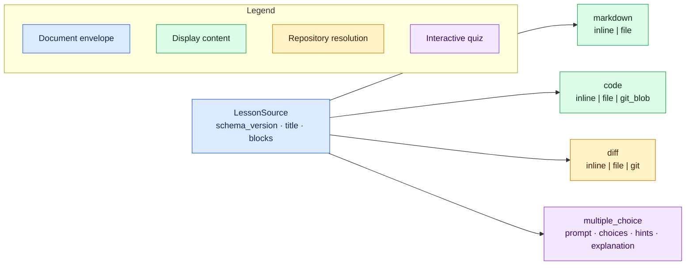

# Authoring v1 lessons

`learnc` accepts one authored JSON document, resolves every referenced resource,
and emits a self-contained `.learn` artifact for `learn`. The format is intended
to be generated by an agent: keep the lesson ordered, explicit, and small enough
for a learner to understand one change at a time.

Use the compiler as the source of truth:

```console
learnc schema --version 1.0.0
learnc check lesson.json
learnc build lesson.json
learn serve lesson.learn
```

Commands emit JSON by default. Add `--text` or `-t` for human-readable output.
`check` runs the complete parse, validation, repository, Git, and diff pipeline
without writing a `.learn` file. Never edit a generated `.learn` artifact; change
the source or referenced inputs and rebuild it.

## Document shape

The v1 envelope has exactly three fields. Every block requires a unique,
human-readable `id`; IDs are the names diagnostics and future references use.
Do not author numeric node IDs or choice IDs—the compiler generates those.



```json
{
  "schema_version": "1.0.0",
  "title": "Why queue removal changed",
  "blocks": []
}
```

### What the JSON Schema can and cannot prove

`learnc schema` is the exact structural schema for the selected source version.
It describes the closed object shapes at every nesting level, required fields,
JSON value types, tagged-union alternatives, the minimum two quiz choices, and
the minimum value of one-based line numbers. Unknown fields are rejected both at
the document root and inside blocks, sources, choices, file selectors, and line
ranges.

Some rules depend on relationships between values or on external state and are
therefore enforced only by `learnc check` and `learnc build`. These include:

- non-blank titles, IDs, Markdown, code, prompts, choices, hints, and explanations;
- document-wide source-ID uniqueness;
- exactly one correct choice per question;
- inclusive range ordering (`end >= start`) and ranges fitting resolved content;
- unique and non-empty Git file selections and range/change intersection;
- path ownership, file existence and UTF-8 decoding;
- Git revision resolution, submodule boundaries, ignored-file rules, and stable
  repository snapshots;
- parsing inline, file, and generated patches into valid structured diffs.

Passing generic JSON Schema validation is useful but not sufficient. Always run
`learnc check` against the intended repository state before building.

The complete, repository-independent
[`inline-lesson.json`](../examples/inline-lesson.json) demonstrates all four
block types and can be checked directly:

```console
learnc check examples/inline-lesson.json
```

## Markdown and code

Markdown supports inline text or a UTF-8 file below the selected repository
root. Raw HTML is not part of the rendering contract.

```json
{
  "type": "markdown",
  "id": "overview",
  "source": { "kind": "file", "path": "docs/overview.md" }
}
```

Code supports inline text, a worktree file, or a blob at a Git revision. Line
ranges are optional, one-based, inclusive, and must exist in the resolved text.

```json
{
  "type": "code",
  "id": "implementation-at-head",
  "source": {
    "kind": "git_blob",
    "revision": "HEAD~2",
    "path": "src/queue.rs",
    "lines": { "start": 70, "end": 118 }
  }
}
```

Paths always use forward slashes and are relative to the selected repository.
Do not use absolute paths, `.` components, or `..`. Agents do not provide
content hashes: the compiler computes them after resolution.

## Diffs

Use an inline or file source when a patch already exists. Put long patches in a
file instead of reproducing them in lesson JSON.

```json
{
  "type": "diff",
  "id": "authored-patch",
  "source": { "kind": "file", "path": "changes/queue.patch" }
}
```

Prefer a declarative Git source for repository changes. This example compares a
symbolic base with the current worktree and asks for two context lines:

```json
{
  "type": "diff",
  "id": "queue-change",
  "source": {
    "kind": "git",
    "base": "HEAD",
    "target": { "kind": "worktree" },
    "files": [
      {
        "path": "src/queue.rs",
        "after_lines": { "start": 82, "end": 90 }
      }
    ],
    "context_lines": 2
  }
}
```

For a committed comparison, use
`"target": { "kind": "revision", "revision": "main" }`. A `before_lines`
range selects deletions by base-side line number; `after_lines` selects additions
or modifications by target-side line number. A selected range that intersects no
change is an error.

One Git diff block may cover files owned by only one Git repository. If selected
paths cross into a submodule, split them into separate diff blocks. Explicitly
selected untracked worktree files become complete additions; ignored files are
rejected.

The compiler invokes Git directly from structured fields. Never place shell
commands or Git argument arrays in the lesson.

## Multiple choice

A multiple-choice block needs at least two Markdown choices and exactly one
`correct: true`. Omitting `correct` means false. Do not give choices IDs.

```json
{
  "type": "multiple_choice",
  "id": "check-order",
  "prompt": "Which operation implements FIFO removal?",
  "choices": [
    { "content": "`pop_front`", "correct": true },
    { "content": "`pop_back`" }
  ],
  "hints": ["FIFO means first in, first out."],
  "explanation": "Removing from the front returns the oldest queued value."
}
```

Hints are public. The correct generated choice ID and explanation are stored in
the artifact's server-owned answer table. An incorrect attempt does not reveal
them; a correct attempt or explicit reveal does.

## Repository selection and freezing

The repository root defaults to the current Git worktree. Override it when the
lesson or agent runs elsewhere:

```console
learnc check --repo /path/inside/worktree lesson.json
learnc build --repo /path/inside/worktree lesson.json -o queue.learn
```

`HEAD`, branch names, and expressions such as `HEAD~2` are valid source
revisions. A successful build records concrete object IDs, embeds resolved
content and structured diffs, keeps only repository-relative provenance, and
writes resource hashes. If selected inputs change during compilation, the build
fails instead of emitting a mixed snapshot.

The complete
[`repository-lesson.json`](../examples/repository-lesson.json) demonstrates file,
Git blob, patch-file, selected worktree-diff, and quiz blocks. It expects the
paths and dirty worktree described by its fields; the integration suite creates
that repository and verifies both `check` and `build`.

## Acting on diagnostics

Default failures are stable JSON and may include several independent problems:

```json
{
  "ok": false,
  "diagnostics": [
    {
      "code": "source.id.duplicate",
      "pointer": "/blocks/3/id",
      "message": "source ID `check-order` is already used by another block",
      "related": [
        {
          "pointer": "/blocks/1/id",
          "message": "the source ID was first declared here"
        }
      ],
      "suggestions": ["Give every block a document-unique source ID."]
    }
  ]
}
```

Branch on `code`, locate the authored value with `pointer`, apply a suggestion
only when it preserves the lesson's intent, then run `learnc check` again. The
compiler never repairs malformed source silently.
