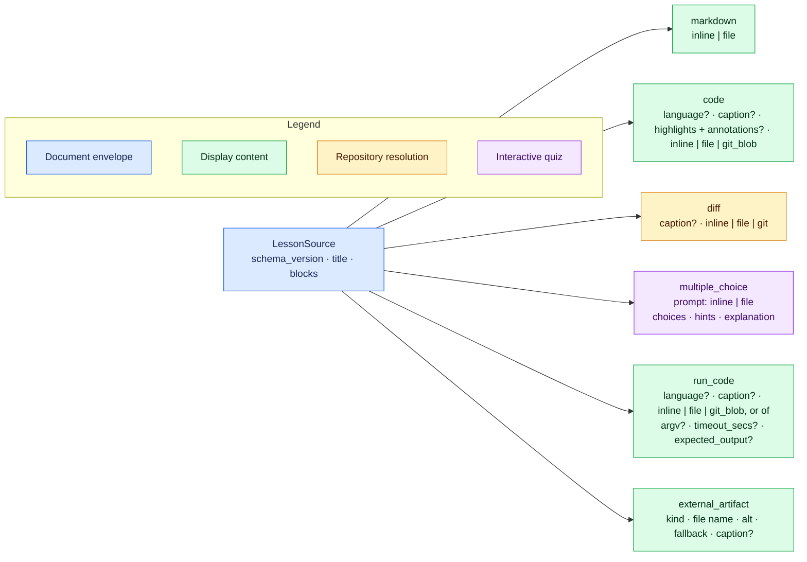

# Authoring v1 lessons

`learnc` accepts one authored JSON document, resolves every referenced resource,
and emits a `.learn` artifact for `learn` that is self-contained apart from
the media of [external artifacts](#external-media). The format is intended
to be generated by an agent: keep the lesson ordered, explicit, and small enough
for a learner to understand one change at a time.

Use the compiler as the source of truth:

```console
learnc schema --version 2.5.0
learnc check lesson.json
learnc lint lesson.json
learnc build lesson.json
learn serve lesson.learn
```

Commands emit JSON by default, including `--help`, `--version`, and invalid
usage. Add `--text` or `-t` for human-readable output; use `learnc -t --help`
for the normal Clap help page.
`check` runs the complete parse, validation, repository, Git, diff, and partial
Mermaid syntax pipeline without writing a `.learn` file. Never edit a generated
`.learn` artifact; change the source or referenced inputs and rebuild it.

## Document shape

The v1 envelope has exactly three fields. Every block requires a unique,
human-readable `id`; IDs are the names diagnostics and future references use.
Do not author numeric node IDs or choice IDs—the compiler generates those.


```mermaid
flowchart LR
    L["LessonSource<br/>schema_version · title · blocks"]:::envelope
    L --> M["markdown<br/>inline | file"]:::content
    L --> C["code<br/>language? · caption? · highlights + annotations? · inline | file | git_blob"]:::content
    L --> D["diff<br/>caption? · inline | file | git"]:::repository
    L --> Q["multiple_choice<br/>prompt: inline | file<br/>choices · hints · explanation"]:::quiz
    L --> R["run_code<br/>language? · caption? · inline | file | git_blob, or of<br/>argv? · timeout_secs? · expected_output?"]:::content
    L --> X["external_artifact<br/>kind · file name · alt · fallback · caption?"]:::content

    subgraph Legend
      LE["Document envelope"]:::envelope
      LC["Display content"]:::content
      LR["Repository resolution"]:::repository
      LQ["Interactive quiz"]:::quiz
    end

    classDef envelope fill:#dbeafe,stroke:#2563eb,color:#172554
    classDef content fill:#dcfce7,stroke:#16a34a,color:#052e16
    classDef repository fill:#fef3c7,stroke:#d97706,color:#451a03
    classDef quiz fill:#f3e8ff,stroke:#9333ea,color:#3b0764
```

```json
{
  "schema_version": "2.5.0",
  "title": "Why queue removal changed",
  "blocks": []
}
```

### What the JSON Schema can and cannot prove

`learnc schema` is the exact structural schema for the selected source version.
Source schema `1.1.0` adds the optional code-block `language` field, and `1.2.0`
adds optional Markdown `caption` fields to code and diff blocks. Source schema
`1.3.0` adds file-backed code `highlights`. The compiler still accepts older
documents, but their closed schemas reject fields introduced later. Source
schema `2.0.0` changes the multiple-choice `prompt` from a string to a Markdown
source object so it can be inline or file-backed. This is a breaking source
shape. Source schema `2.1.0` adds optional Markdown annotations to code
highlight groups, and `2.2.0` adds optional per-choice explanations for
distractors. Source schema `2.3.0` has the same shape and turns `#block-id`
links into block links (see [Linking blocks](#linking-blocks)). Source schema
`2.4.0` adds the `run_code` block (see [Running code](#running-code)); older
schemas reject it. Source schema `2.5.0` adds the `external_artifact` block
(see [External media](#external-media)); older schemas reject it too. Use
`2.5.0` for new lessons.
It describes the closed object shapes at every nesting level, required fields,
JSON value types, tagged-union alternatives, the minimum two quiz choices, and
the minimum value of one-based line numbers. Unknown fields are rejected both at
the document root and inside blocks, sources, choices, file selectors, and line
ranges.

The schema also requires every text field (title, IDs, paths, revisions,
inline content, captions, annotations, choices, hints, and explanations) to be
non-blank, and rejects control characters in IDs, paths, and revisions. Some
rules depend on relationships between values or on external state and are
therefore enforced only by `learnc check` and `learnc build`. These include:

- document-wide source-ID uniqueness;
- exactly one correct choice per question;
- inclusive range ordering (`end >= start`) and ranges fitting resolved content;
- highlighted ranges remaining inside the displayed file fragment, with no
  overlap between different colors;
- a run block giving exactly one of `source` and `of`, `of` naming a code
  block, a runnable language, and an `argv` that contains `{file}`;
- an external-artifact file name being a bare name whose extension suits its
  `kind`;
- unique and non-empty Git file selections and range/change intersection;
- path ownership, file existence and UTF-8 decoding;
- Git revision resolution, owning-repository boundaries, ignored-file rules,
  and stable repository snapshots;
- parsing inline, file, and generated patches into valid structured diffs.

Passing generic JSON Schema validation is useful but not sufficient. Always run
`learnc check` against the intended repository state before building.

### Authoring-policy lint

Run `learnc lint lesson.json` after `check` to get advice about presentation
choices. Lint runs the compilation checks first and reports their failures
unchanged. Its own findings never affect `check` or `build`. An inline code,
diff, or run-block source, or an inline run-block `expected_output`, over 256
decoded characters, inline Markdown or quiz prompt over 512 characters, or a
diff that presents a new file is a lint `error` by default.
Other rules cover code language and length, highlights, filename context,
answer-choice balance, question frequency, questions with three or more choices
but no hints or with unexplained distractors, diff hunks that are mostly
additions, names formatted as code in prose but
never shown in a code, diff, or run block, run blocks without an
`expected_output`, and Mermaid `subgraph`/`style` use in
flowcharts and class diagrams. External-media blocks have no lint rules of
their own yet. The
complete rule and threshold table is in [`LINT_DESIGN.md`](LINT_DESIGN.md).

Lint emits `{"diagnostics":[]}` for a clean JSON run, or no text with `-t`.
Findings include a stable code, intrinsic severity, fatality, block ID, JSON
pointer, suggestion, and a one-based editable file span. Lesson-wide findings
have `block_id: null`. By default only lint `error` findings make the command
exit nonzero. `--warning-as-error warning` also makes `warning` and `critical`
findings fatal; `--ignore-below critical` omits `warning` and `info` before
fatality is calculated. Individual `info` rules can be switched off with
`--ignore-code <CODE>` or the TOML `ignore_codes` list; other severities cannot
be ignored by code. These options do not affect compilation validity.

After lint, the optional `learnverify lesson.json` asks the TypeSafe API
yes/no questions about each quiz and highlighted code block (does a hint give
the answer away, is a distractor a giveaway, does an annotation contradict its
code, ...). Its findings use lint's format and are advice only; see
[`LEARNVERIFY.md`](LEARNVERIFY.md).

Thresholds can be overridden with CLI flags, an explicitly selected TOML file,
or both:

```console
learnc lint --config lint.toml --max-code-lines 40 --warning-as-error warning lesson.json
```

The root [`config.example.toml`](../config.example.toml) lists every setting
and its default. A file may contain only the settings you want to override.
CLI flags take precedence over that file; omitted settings keep their defaults.
For example, `--max-code-lines 40` changes only the large-code warning
threshold. Unknown config keys are errors. Config files are not discovered
automatically.

The complete, repository-independent
[`inline-lesson.json`](../examples/inline-lesson.json) demonstrates the
Markdown, code, diff, and multiple-choice blocks and can be checked directly:

```console
learnc check examples/inline-lesson.json
```

## Markdown and code

Markdown supports inline text or a UTF-8 file below the selected filesystem
root. Raw HTML is not part of the rendering contract. Use Markdown blocks for
all prose that should render as Markdown, including headings, lists, emphasis,
and explanations. Do not put ordinary Markdown prose in a code block: code
blocks intentionally display literal text. A code block should use language
`markdown` only when the lesson is explicitly teaching Markdown syntax, and
then it should contain the smallest useful literal fragment rather than an
entire prose section.

Markdown fields support KaTeX mathematics. Use `$...$` for inline notation and
put `$$` delimiters on their own lines for display notation. This works in
standalone Markdown blocks and every other Markdown-bearing field, including
quiz prompts, choices, hints, explanations, code or diff captions, and
code-highlight annotations. KaTeX
implements a mathematical subset of LaTeX rather than a complete LaTeX
document processor. Keep formulas out of code fences unless the literal LaTeX
source is itself the subject of the lesson.

```markdown
The invariant is $0 \leq i < n$.

$$
\sum_{i=1}^{n} i = \frac{n(n+1)}{2}
$$
```

```json
{
  "type": "markdown",
  "id": "overview",
  "source": { "kind": "file", "path": "docs/overview.md" }
}
```

Code supports inline text, a worktree file, or a blob at a Git revision. Its
optional `language` controls syntax presentation. Line ranges are optional,
one-based, inclusive, and must exist in the resolved text.
For file and Git-blob sources, the runtime shows the source basename in the code
header; inline code has no invented filename.

Code and diff blocks also accept an optional Markdown `caption`. Use it only for
block-local information the learner cannot infer from the rendered content. It
is most useful for a Mermaid diagram whose important assumption, omission, or
relationship is not self-explanatory. Do not caption routine code, restate
visible labels or syntax, or narrate diagram arrows and reading direction.
General teaching prose still belongs in surrounding Markdown blocks.

```json
{
  "type": "code",
  "id": "implementation-at-head",
  "language": "rust",
  "highlights": [
    { "lines": [{ "start": 76, "end": 80 }] },
    {
      "lines": [{ "start": 103, "end": 106 }],
      "color": "blue",
      "annotation": "This branch preserves the previous value until the **commit point**."
    }
  ],
  "source": {
    "kind": "git_blob",
    "revision": "HEAD~2",
    "path": "src/queue.rs",
    "lines": { "start": 70, "end": 118 }
  }
}
```

Highlights direct attention without removing useful surrounding context. They
are available only on `file` and `git_blob` code sources and use absolute,
one-based, inclusive line numbers from the original file—not positions relative
to the selected fragment. A group may contain several `lines` ranges. Its
optional `color` is `yellow` by default and may also be `green`, `red`, or
`blue`. Source schema `2.1.0` also lets a group carry an optional Markdown
`annotation`. The runtime shows annotated groups persistently with their color
and line references, and repeats the explanation beside a range when its `i`
marker is activated by click, tap, Enter, or Space. Activating the same marker
again closes the popup. The explanation therefore remains available without
hover and does not rely on color alone. One annotation applies to every range
in its group; split
ranges into separate groups, even with the same color, when their explanations
differ. Differently colored ranges cannot overlap. The compiler verifies the
ranges against the resolved content and stores fragment-relative positions and
grouping in the artifact.

Do not highlight most of a block merely for decoration; narrow the source
`lines` range when less context would be clearer. Inline code cannot carry
highlights. Write generated content to at least a temporary file when it needs
line emphasis. Mermaid blocks render as diagrams and also reject source-line
highlights; use a substantive caption or nearby Markdown when a diagram needs
additional explanation.

Code comments and highlight annotations serve different purposes. Keep or add
concise comments inside agent-authored code when they convey local intent that
the code alone cannot, particularly when separate blocks show different parts
or states of the same file. Do not rely on a block ID to explain why a fragment
was included. Preserve pedagogically relevant comments when selecting ranges
from real files, but do not modify repository source solely to add lesson
commentary; use a highlight annotation or nearby Markdown instead. Omit
comments that merely narrate obvious syntax.

The canonical language names are `rust`, `python`, `javascript`, `typescript`,
`c`, `cpp`, `go`, `java`, `shell`, `json`, `yaml`, `toml`, `html`, `css`,
`xml`, `sql`, `markdown`, `mermaid`, and `text`. The accepted aliases normalize
as follows:

| Canonical | Accepted aliases |
| --- | --- |
| `rust` | `rs` |
| `python` | `py` |
| `javascript` | `js`, `jsx`, `mjs`, `cjs` |
| `typescript` | `ts`, `tsx`, `mts`, `cts` |
| `c` | `h` |
| `cpp` | `c++`, `cxx`, `cc`, `hpp`, `hxx`, `hh` |
| `go` | `golang` |
| `shell` | `sh`, `bash`, `zsh`, `fish` |
| `json` | `jsonc` |
| `yaml` | `yml` |
| `html` | `htm` |
| `xml` | `xsl`, `xslt`, `svg` |
| `css` | `scss`, `sass` |
| `markdown` | `md`, `mdx` |
| `mermaid` | `mmd` |
| `text` | `txt`, `plain`, `plaintext` |

`java`, `toml`, and `sql` need no aliases. When `language` is omitted from
a file or Git-blob source, the compiler infers it from the path extension.
Extensionless names such as `Makefile` and `Dockerfile`, and any other
unrecognized path, fall back to plain text. Inline sources have no filename to
inspect, so set `language`
explicitly when syntax coloring or special rendering matters. An unknown explicit
language also normalizes to `text` instead of making the lesson invalid.

Mermaid is the one code language with semantic rendering: a code block that
resolves to `mermaid` is rendered as a diagram. Author the diagram as an inline
code source rather than a Mermaid fence inside Markdown:

```json
{
  "type": "code",
  "id": "compiler-flow",
  "language": "mermaid",
  "caption": "The artifact is the freeze boundary: `learn` reads compiled content and does not revisit the source repository.",
  "source": {
    "kind": "inline",
    "content": "flowchart LR\n  Source --> Compiler --> Artifact"
  }
}
```

Use `language: "text"` when Mermaid source should be shown literally instead
of rendered as a diagram. If a Mermaid diagram is invalid, the runtime shows
its escaped source instead of injecting a partial rendering.

Sequence diagrams use the same code-block shape and begin their content with
`sequenceDiagram`. Use them for time-ordered interactions rather than static
structure. The runtime keeps their natural width inside a horizontally
scrollable canvas and omits Mermaid's duplicate bottom row of participants:

```json
{
  "type": "code",
  "id": "build-sequence",
  "language": "mermaid",
  "source": {
    "kind": "inline",
    "content": "sequenceDiagram\n  autonumber\n  participant A as Agent\n  participant C as Compiler\n  A->>C: Build lesson\n  activate C\n  C-->>A: Return artifact\n  deactivate C"
  }
}
```

Sequence diagrams do not accept flowchart `classDef` and `class` statements,
so they do not produce the class-derived legend below. Use participant aliases,
message labels, notes, and a substantive block caption to make their meaning
clear.

When color communicates semantic categories, define named `classDef` styles
and assign nodes with `class`. The runtime derives a compact legend from those
definitions, using the semantic class name as its label. Diagrams without
`classDef` styles have no legend. Prefer a few meaningful classes over
decorative `subgraph` containers or one-off node styles.

Paths always use forward slashes and are relative to the selected filesystem
root. Do not use absolute paths, `.` components, or `..`. Agents do not provide
content hashes: the compiler computes them after resolution.

## Diffs

Keep each diff next to the explanation and code it belongs to. A useful local
narrative unit introduces one concept, shows the relevant code when needed,
presents its diff, explains the effect, and optionally asks a follow-up
question. Repeat that shape in authored order rather than stacking unrelated
diffs at the end of the lesson. A final aggregate diff belongs only in a lesson
that explicitly needs one as a recap. The compiler infers each structured diff
file's language from its displayed path and the runtime applies the same syntax
highlighting used for code blocks; diff blocks do not take a separate authored
`language` field.

Use an inline or file source when a patch already exists. Put long patches in a
file instead of reproducing them in lesson JSON.

```json
{
  "type": "diff",
  "id": "authored-patch",
  "source": { "kind": "file", "path": "changes/queue.patch" }
}
```

Prefer a declarative Git source for repository changes. This example compares a
symbolic base with the current worktree and asks for two context lines:

```json
{
  "type": "diff",
  "id": "queue-change",
  "source": {
    "kind": "git",
    "base": "HEAD",
    "target": { "kind": "worktree" },
    "files": [
      {
        "path": "src/queue.rs",
        "after_lines": { "start": 82, "end": 90 }
      }
    ],
    "context_lines": 2
  }
}
```

For a committed comparison, use
`"target": { "kind": "revision", "revision": "main" }`. A `before_lines`
range selects deletions by base-side line number; `after_lines` selects additions
or modifications by target-side line number. A selected range that intersects no
change is an error, and so is a selected path with no change between the
compared states (usually a typo or the wrong revision pair). Select files, not
directories.

One Git diff block may cover files owned by only one Git repository. Git finds
the nearest owning repository independently for every selected path, so sibling
repositories and submodules are both supported beneath one root. Split paths
with different owners into separate diff blocks. Explicitly selected untracked
worktree files become complete additions; ignored files are rejected.
When one resolved diff contains multiple files, the runtime lets the learner
fold each file independently. Single-file diffs keep only the block-level fold.

A Markdown file in a **Git** diff also renders as Markdown. The compiler reads
the complete before and after documents, splits them into blocks (headings,
paragraphs, fences, tables, math, and each item of a top-level list or block
quote), and marks added blocks in green and removed ones struck through in
red. A changed block shows as its old version followed by its new one; there
is no word-level marking yet. The rendered view covers the same part of the
file as the line diff, widened to whole blocks, with the rest summarized as
"⋯ N blocks not shown". A `Rendered | Source` switch shows the line diff.
Inline and file patches contain only hunks, which cannot be rendered safely,
so their Markdown files keep the line view; lint reports this as
`lint.diff.markdown_patch`.

The compiler invokes Git directly from structured fields. Never place shell
commands or Git argument arrays in the lesson.

## Multiple choice

A multiple-choice block needs at least two Markdown choices and exactly one
`correct: true`. Omitting `correct` means false. Do not give choices IDs.
`learnc` scrambles the presented choice order during compilation, assigns IDs
to that order, and freezes both the order and matching private answer in the
`.learn` artifact. The order is derived from the question's ID, prompt, and
choices, so rebuilding an unchanged lesson produces an identical artifact. Write choices for semantic quality rather than trying
to vary where the correct answer appears; `learn` preserves the compiled order
across refreshes.

```json
{
  "type": "multiple_choice",
  "id": "check-order",
  "prompt": {
    "kind": "inline",
    "content": "Which operation implements FIFO removal?"
  },
  "choices": [
    { "content": "`pop_front`", "correct": true },
    {
      "content": "`pop_back`",
      "explanation": "That removes the newest value, which is stack (LIFO) behavior."
    }
  ],
  "hints": ["FIFO means first in, first out."],
  "explanation": "Removing from the front returns the oldest queued value."
}
```

Since source schema `2.2.0`, a distractor may carry its own Markdown
`explanation` saying why it is wrong. Like the block `explanation`, it stays in
the artifact's private answer data and appears under its choice only after the
question is answered correctly or the answer is revealed; a wrong attempt never
shows it. The correct choice cannot have one (`source.quiz.choice_explanation.on_correct`):
its reasoning belongs in the block `explanation`. Lint reports questions with
three or more choices where some distractor has no explanation, and questions
whose prompt, hints, correct choice, or explanation format as code a
code-shaped name (`pop_front`, `self.len`, `Queue`, `push()`) that no code or
diff block shows (`lint.question.unshown_answer_code`, a warning):
show the code a question relies on before asking it.

In source schema `2.0.0`, only the prompt uses a Markdown source object. Choices,
hints, and explanations remain inline Markdown strings. Use a file source when
the prompt needs substantial formatting without JSON escaping:

```json
"prompt": {
  "kind": "file",
  "path": ".learn/questions/queue-order.md"
}
```

The path is relative to the selected filesystem root and must remain available
through `learnc check` or `learnc build`. A successful build freezes its UTF-8
contents into the artifact, so a genuinely temporary prompt file may then be
removed; keep it when the authored lesson must remain rebuildable.

Hints are public. The correct generated choice ID and explanation are stored in
the artifact's server-owned answer table. An incorrect attempt does not reveal
them; a correct attempt or explicit reveal does.

## Running code

A `run_code` block (source schema `2.4.0`) is code the learner can run during
the lesson, with the output shown in place. Nothing runs unless the learner
starts `learn serve --allow-run` themselves (authoring agents never start
`learn`). Without the flag a run block shows its code (or a pointer to the
block it runs) and its `expected_output`, the output frozen when the lesson was
built, plus a hint about the flag. So author every run block to be useful
without a run, which means giving it an `expected_output` that you produced by
running the code.

With `--allow-run` the block gets a Run button. A run:

- executes the frozen code, never the worktree or the real project, written to
  the frozen scratch file name in a fresh scratch directory that is removed
  afterwards, which is also the working directory;
- spawns the frozen command directly with stdin closed and the learner's
  environment, so the interpreter must be installed on the learner's machine
  (a missing one is shown as an error, not a failure of the lesson), and the
  code has the learner's permissions;
- is stopped at `timeout_secs`, together with every process it started, and is
  then shown as timed out;
- keeps at most 64 KiB of each of stdout and stderr and says when it cut them;
- shows stdout, stderr (set apart), the exit code, and the duration. A
  non-zero exit or a timeout is an ordinary result, not an error;
- runs once at a time per block, and the last result of each block survives a
  browser refresh but is lost when `learn` stops. A run never affects quiz
  progress.

The frozen `expected_output` stays visible beside a real result, labelled as
frozen, so a learner can compare them. Keep programs deterministic and free of
network, clock, or input dependencies, or the two will differ for no reason.

```json
{
  "type": "run_code",
  "id": "demo",
  "language": "python",
  "caption": "Optional Markdown.",
  "source": { "kind": "inline", "content": "print(1 + 1)\n" },
  "timeout_secs": 10,
  "expected_output": { "kind": "inline", "content": "2\n" }
}
```

**The code.** Give exactly one of:

- `source`: the code's own source, with the same `inline`, `file`, and
  `git_blob` shapes (and `lines` rules) as a code block. The block shows it
  with syntax highlighting. Highlights are not supported.
- `of`: the ID of a code block, to run the code that block shows. The run block
  then shows no code of its own, only "Runs `<block-id>`" as a link that
  previews and jumps to that block. `of` forbids `source` and `language`; the
  code and language come from the referenced block (a later block is fine).
  Use it to explain code first and run it afterwards without showing it twice.

**The language** is resolved like a code block's: the explicit `language`,
else the extension of a file or Git-blob path, else plain text. `mermaid` is
not runnable.

**The command.** Without `argv`, the language must be in this table, and
`learnc check` fails with `source.run_code.no_runner` otherwise:

| Language | Command |
| --- | --- |
| `python` | `python3 {file}` |
| `javascript` | `node {file}` |
| `shell` | `sh {file}` |

`argv` replaces the table for any language: a nonempty list of nonblank
strings in which `{file}` (at least once, possibly inside an argument such as
`--input={file}`) stands for the scratch file the code is written to. The
command is spawned directly, with no shell unless `argv` is itself a shell. The
compiler freezes the final command and the scratch file name (`main` plus the
language's extension, such as `main.py`; `main.txt` for an unrecognized
language) in the artifact, so `learn` has no language logic of its own.

```json
{
  "type": "run_code",
  "id": "ruby-demo",
  "language": "ruby",
  "argv": ["ruby", "{file}"],
  "source": { "kind": "inline", "content": "puts 6 * 7\n" },
  "expected_output": { "kind": "inline", "content": "42\n" }
}
```

**Limits and output.** `timeout_secs` is an integer from 1 to 60 and defaults
to 10. `expected_output` is an `inline` or `file` source of literal text, shown
verbatim (it is not Markdown) under a label saying it was frozen when the
lesson was built. A file is read at build time like any other source. The
optional `caption` is Markdown, like a code block's.

A run block is an ordinary block in every other way: it folds, can be asked
about, and can be the target of a whole-block link (`#demo`, but not a line
range, because it is not a code block). A caption's links are checked like any
other Markdown. Lint treats a run block's own `source` like a code block's:
it counts as code the lesson shows, an inline source or inline
`expected_output` over 256 characters is an `error`, and more than 60 displayed
lines is a warning. A block of `of` shows no code of its own. Lint also reports
a run block without `expected_output`
(`lint.run_code.no_expected_output`, `info`), since without a run it shows only
its code.

| Diagnostic | Meaning |
| --- | --- |
| `source.run_code.source_and_of` | Both `source` and `of` are present. |
| `source.run_code.no_source` | Neither `source` nor `of` is present. |
| `source.run_code.of_with_language` | `language` was given with `of`. |
| `source.run_code.unknown_block` | `of` names no block. |
| `source.run_code.of_not_code` | `of` names a block that is not a code block. |
| `source.run_code.not_runnable` | The language is `mermaid`. |
| `source.run_code.no_runner` | No `argv`, and the language is not in the table. |
| `source.run_code.invalid_argv` | `argv` is empty, has a blank entry, or has no `{file}`. |
| `source.run_code.invalid_timeout` | `timeout_secs` is outside 1 to 60. |

Not part of this feature: editing code in the browser, input on stdin,
streamed output, saved runs, running the real project or its dependencies, and
`learnverify` checks of run blocks. The code that runs is always the frozen
copy in the artifact, never the worktree.

## External media

An `external_artifact` block (source schema `2.5.0`) refers to an image, audio,
or video file that is produced outside the compiler, and always carries text to
show when that file is not available. `learn` serves the file from a directory
next to the artifact (see [The sidecar contract](#the-sidecar-contract)) and
shows the media when the file is there; otherwise the block shows its caption
and its `fallback`, labelled so the learner knows the media itself is not
available. The file may never exist, so write every block to work as text
alone.

```json
{
  "type": "external_artifact",
  "id": "queue-demo",
  "kind": "video",
  "file": "queue-demo.mp4",
  "alt": "Animation of items entering and leaving a FIFO queue",
  "fallback": "Items enter at the back and leave from the front, so the **oldest** item always leaves first.",
  "caption": "Optional Markdown."
}
```

- `kind` is `image`, `audio`, or `video`.
- `file` is a bare file name, such as `queue-demo.mp4`, not a path. It must not
  be empty, contain `/` or `\`, be `.` or `..`, start with `.`, or contain a
  control character (`source.external_artifact.invalid_file_name`).
- `alt` is required plain text that describes the media for someone who cannot
  see or hear it. It is not Markdown.
- `fallback` is required Markdown, an inline string like a code block's
  `caption` (there is no file form): block links (`[the code](#queue-def)`)
  and KaTeX work as in any other Markdown field.
- `caption` is optional Markdown, like a code block's.

`alt`, `fallback`, and `caption` must not be blank (`source.content.empty`),
the same code other blank fields use.

**Extensions.** The extension of `file` must belong to its `kind`, compared
case-insensitively (`Queue.MP4` is fine), or `check` fails with
`source.external_artifact.extension_not_allowed`. A name with no extension is
rejected the same way. The allowlist is:

| `kind` | Extensions |
| --- | --- |
| `image` | `png`, `jpg`, `jpeg`, `gif`, `webp`, `svg`, `avif` |
| `audio` | `mp3`, `wav`, `ogg`, `m4a`, `aac`, `flac` |
| `video` | `mp4`, `webm`, `mov`, `ogv` |

The check compares names only; it does not inspect any file, so it cannot tell
that a file named `x.mp4` is really a video.

**Write a real fallback.** The fallback is what a learner reads when the file
is missing, which is the normal state until you produce it. Say in words what the media would
have shown or said: the steps of the animation, the labels and arrows of the
diagram, the content of the narration. Do not write "see the video", a
placeholder, or a restatement of the file name. Do not invent a file either:
only name a file that you have produced, or will produce, yourself.

**Producing the file.** The file is made out of band, by whatever tool the
authoring agent already has and is allowed to use: `ffmpeg`, `graphviz`,
`matplotlib`, or a paid generation service. Neither `learnc` nor `learn`
generates media, calls any generation API, or holds a key for one, and neither
will. A generated file is never part of the lesson source or the artifact, and
the block works the same whether or not the agent ever produces it.

**Why `check` cannot verify the file.** `learnc check` and `build` read only the
lesson JSON and the inputs it references; an external artifact references
none, so they touch no file system or repository for it (a lesson made only of
external-artifact and other inline blocks compiles with no root and no
repository). That is deliberate: the file is expected to be produced after the
build, because generating video is slow and costs money, so its absence at
build time is normal and a missing or misspelled file name is not detected.
`build` freezes only `kind`, `file`, `alt`, `fallback`, and `caption`; there is
no hash or provenance for the file.

### The sidecar contract

The file is not embedded in the artifact. `learn serve dir/queue.learn` looks
for `file` in the directory next to the artifact whose name is the artifact
path with `.assets` in place of its extension: `dir/queue.assets/`. An artifact
path without an extension gets `.assets` appended (`dir/queue` has
`dir/queue.assets/`). The directory is fixed from the path given to `learn`
when it starts, so a relative path keeps working from where it was launched.
Put the file directly in that directory, named exactly as `file` (a
subdirectory, a directory with that name, or a symbolic link that leads
outside the directory is not served). If the file is there it is shown, as an
image, or as an audio or video player with controls; if not, the fallback is.
When the media shows, the fallback stays reachable in a folded "Text version"
under it, and a file the browser cannot load is replaced by the fallback.

Availability is looked up on every state request, never when `learn` starts. So
you can run `learnc build` first and generate the media later, even while the
learner has `learn` running: put the file in `queue.assets/` and have the
learner refresh the page. Nothing needs rebuilding, and replacing a file shows
the new one after a refresh too. An open page does not update by itself.

`learn serve` writes one warning to stderr at startup for each file it does not
find, naming the block, the file, the sidecar directory, and that the fallback
will be shown; it never fails the launch, since generating the file later is
normal. `learnc check` cannot warn because it never looks at files. The
accepted consequence is that an artifact with such blocks is not fully
self-contained: moving a `.learn` file without its `.assets/` directory loses
the media, though the fallback still renders, so keep them together when you
hand a lesson over. Agents still never start `learn`: describe where the files
go and let the learner start it.

A media block is an ordinary block in every other way: it folds, can be asked
about, and can be the target of a whole-block link (`#queue-demo`, but not a
line range, because it is not a code block). A link to it previews its `alt`
text and its fallback. Links in its `fallback` and `caption` are checked like
any other Markdown, so a link to an unknown block fails with
`source.reference.unknown_block`. Like a quiz, it has no source resource, so a
learner's copied reference names the block and the fallback text, and the
exact text lives in the lesson. `learnverify` includes the block's text as
quiz context; neither lint nor `learnverify` has rules for it yet.

| Diagnostic | Meaning |
| --- | --- |
| `source.external_artifact.invalid_file_name` | `file` is empty, has a path separator, is `.` or `..`, starts with `.`, or has a control character. |
| `source.external_artifact.extension_not_allowed` | The extension of `file` is missing or not in the allowlist of its `kind`. |
| `source.content.empty` | `alt`, `fallback`, or `caption` is blank. |

## Filesystem root, repositories, and freezing

Every authored path is relative to one filesystem root. The root defaults to
the compiler's current working directory and does not itself need to be a Git
repository. It must, however, contain every repository that owns a Git-backed
path: a root inside a repository fails with `repository.owner_above_root`.
Override it when the lesson inputs live elsewhere:

```console
learnc check --root /path/to/workspace lesson.json
learnc build --root /path/to/workspace lesson.json -o queue.learn
```

For Git-backed sources, the compiler asks Git for the nearest owner of each
referenced path. A single lesson can therefore use unrelated repositories such
as `repo-a/src/a.rs` and `repo-b/src/b.rs` under the same selected root.
`HEAD`, branch names, and expressions such as `HEAD~2` are valid source
revisions. A successful build records concrete object IDs, embeds resolved
content and structured diffs, keeps only root-relative paths and owning-repository
provenance, and writes resource hashes. If selected inputs change during
compilation, the build fails instead of emitting a mixed snapshot.

The complete
[`repository-lesson.json`](../examples/repository-lesson.json) demonstrates file,
Git blob, patch-file, selected worktree-diff, and quiz blocks. Because those
sources require committed history plus a deliberate worktree change, create its
complete disposable repository before compiling it:

```console
repository=$(examples/create-repository-lesson.sh)
learnc check --root "$repository" "$repository/lesson.json"
learnc build --root "$repository" "$repository/lesson.json"
learn serve "$repository/lesson.learn"
```

The setup script prints the temporary repository path and leaves it in place for
inspection. Remove that directory when finished. From a source checkout,
`just repository-example` performs the complete setup, check, build, and serve
workflow and removes the temporary repository when the server exits. The
integration test invokes the same setup script, so the documented example and
tested fixture cannot silently diverge.

## Linking blocks

Since source schema `2.3.0`, any Markdown can link to another block by its ID,
so a later block can point at a definition instead of repeating it:

```markdown
`pop_front` returns an item of the [`Queue`](#queue-def) buffer, whose
[`items` field](#queue-def:12-18) holds the values.
```

`#queue-def:12-18` links part of a code or diff block, using the line numbers
its gutter shows: file lines for file and Git-blob code, positions for inline
code, and new-side lines for diffs. Learners get a preview of the target on
hover or focus, trimmed to the linked lines, and clicking jumps to the block
(Back returns). A preview of a question shows only its prompt.

`learnc check` rejects a link to an unknown block
(`source.reference.unknown_block`), a malformed or out-of-range line range
(`source.reference.invalid_lines`), and a range on a Markdown, question,
run, or external-media block (`source.reference.lines_on_non_code`). Lint then
reports previews longer than 15 lines (a run block previews its whole code, an
external-media block its alt text and fallback), links to the next or previous block, links to a later
block, excerpts repeated far apart, and names formatted as code that no nearby
block shows; `learnverify` asks whether each link's target shows what its text
says. In schemas before `2.3.0`, `#…` links remain ordinary links.

## Go to definition

Names in code link to the definitions the lesson itself shows, with no
authoring needed. Hovering a name for a moment previews its definition, and
Cmd/Ctrl+click jumps to it (Back returns). Code looks unchanged until hovered.

The compiler recognizes definitions by the keywords that start them, not by
parsing: Rust (`fn`, `struct`, `enum`, `trait`, `type`, `union`, `mod`,
`const`, `static`, `macro_rules!`), Python (`def`, `class`), JavaScript and
TypeScript (`function`, `class`, `interface`, `type`, `enum`, `namespace`,
top-level `const`/`let`/`var`, methods), Go (`func`, including methods and
generics, `type`, top-level `const`/`var`), Java (types and method
signatures), C and C++ (`struct`, `enum`, `union`, `class`, `namespace`,
`typedef`, function signatures), shell (`name() {`, `function name {`), and SQL
(`CREATE TABLE`/`VIEW`/`FUNCTION`/...). Code blocks and the new-side lines of
diffs are scanned; other languages define nothing.

A function only links where it is called (`key(…)`), a macro only as `name!`,
and types, constants, and shell functions wherever they appear; names in
comments and strings never link. When the lesson shows several definitions of
one name, the learner gets a small chooser instead of a guess.

## Questions about a lesson

Learners can copy a reference to any block for their agent: an icon appears in
a block's header on hover or focus, and selecting lines in a code or diff block
offers a small "Ask" chip. The copied text names the lesson, the block, the
file and source lines shown, the exact version (commit and blob IDs, or the
worktree blob and the `HEAD` it was built on), and the `.learn` file holding the
frozen content; it never includes the content itself or quiz answers. Authors
do nothing extra, but keeping the lesson source inside the filesystem root lets
the reference name it.

## Acting on diagnostics

Default failures are stable JSON and may include several independent problems:

```json
{
  "ok": false,
  "diagnostics": [
    {
      "code": "source.id.duplicate",
      "pointer": "/blocks/3/id",
      "message": "source ID `check-order` is already used by another block",
      "related": [
        {
          "pointer": "/blocks/1/id",
          "message": "the source ID was first declared here"
        }
      ],
      "suggestions": ["Give every block a document-unique source ID."]
    }
  ]
}
```

Branch on `code`, locate the authored value with `pointer`, apply a suggestion
only when it preserves the lesson's intent, then run `learnc check` again. The
compiler never repairs malformed source silently.
