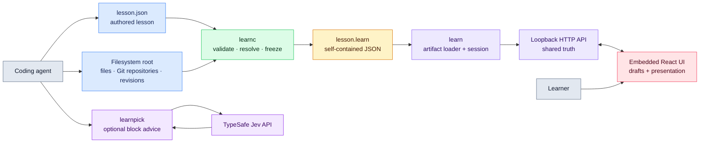
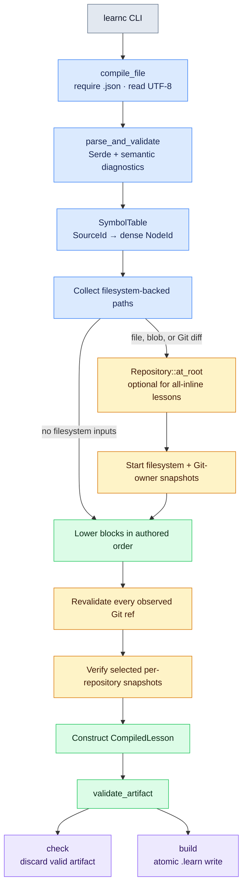
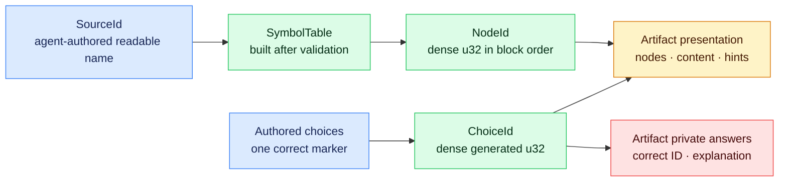

# Developer guide

This guide maps the v1 implementation from authored lesson JSON to the browser.
It describes the code that exists today, the invariants each layer owns, and the
places that must change when the format or runtime grows.

The accepted behavior is defined in [`DESIGN_REVIEW.md`](../DESIGN_REVIEW.md).
Lesson authors should use [`docs/AUTHORING.md`](AUTHORING.md); this document is
for people changing the compiler, artifact, server, or frontend.

## Start here

The project is one Cargo package with three binaries:

- [`learnc`](../src/bin/learnc.rs) reads authored JSON and repository state,
  validates and freezes everything, and optionally writes a `.learn` artifact.
- [`learn`](../src/bin/learn.rs) reads only a compiled artifact, owns the learner
  session, and serves the embedded React application on loopback.
- [`learnpick`](../src/bin/learnpick.rs) is an optional network-backed adviser
  that recommends one block type. Its library module is isolated from the core
  binaries and subsystems; see [`docs/LEARNPICK.md`](LEARNPICK.md).

For a first pass through the implementation, read these files in order:

1. [`src/lib.rs`](../src/lib.rs) — top-level module and trust boundaries.
2. [`src/source/model.rs`](../src/source/model.rs) — authored JSON language.
3. [`src/compiler/mod.rs`](../src/compiler/mod.rs#L55) — compilation pipeline.
4. [`src/artifact/mod.rs`](../src/artifact/mod.rs) — `.learn` contract.
5. [`src/runtime/model.rs`](../src/runtime/model.rs) — artifact loading and public projection.
6. [`src/runtime/session.rs`](../src/runtime/session.rs) — learner state machine.
7. [`src/runtime/server.rs`](../src/runtime/server.rs) — HTTP API and embedded assets.
8. [`web/src/App.tsx`](../web/src/App.tsx) — browser bootstrap and mutation flow.

Run `just` to list the development commands. The usual pre-review check is:

```sh
just verify
```

The distribution-level check is:

```sh
just release-check
```

## System map

Gray is an external actor, blue is authored or repository input, green is
compiler work, amber is the persistent artifact, purple is runtime-owned state,
and rose is browser presentation.



The boundary between `learnc` and `learn` is deliberate. Only the compiler
reads repositories or invokes Git. The runtime receives resolved content and
never reopens the lesson source or worktree.

The `learnpick` path is deliberately one-way and optional. `src/lib.rs` exposes
the module and `src/bin/learnpick.rs` calls it, but `learnc`, `learn`, and all
compiler, runtime, source, artifact, and repository modules have no dependency
on it. A picker or API failure therefore cannot affect validation, compilation,
artifacts, or study sessions.

## Repository map

| Path | Responsibility |
| --- | --- |
| [`src/bin/learnc.rs`](../src/bin/learnc.rs) | Compiler CLI, JSON/text reporting, `check`, `build`, and `schema`. |
| [`src/cli.rs`](../src/cli.rs) | Shared Clap-driven output-mode detection and structured JSON help/version descriptions. |
| [`src/source/`](../src/source) | Authored model, `SourceId`/`NodeId`, JSON Schema, and source-only validation. |
| [`src/language.rs`](../src/language.rs) | Canonical code-language normalization, path inference, aliases, and plain-text fallback. |
| [`src/diagnostics.rs`](../src/diagnostics.rs) | Stable diagnostic codes, JSON Pointers, related locations, and suggestions. |
| [`src/repository/`](../src/repository) | Validated repository paths, Git execution, content resolution, diff parsing, and consistency guards. |
| [`src/compiler/mod.rs`](../src/compiler/mod.rs) | Adapts source types to repository requests and lowers resolved blocks into an artifact. |
| [`src/artifact/mod.rs`](../src/artifact/mod.rs) | Versioned serialized contract shared by compiler and runtime. |
| [`src/bin/learn.rs`](../src/bin/learn.rs) | Runtime CLI and startup/error output. |
| [`src/bin/learnpick.rs`](../src/bin/learnpick.rs) | Optional adviser CLI and JSON/text result projection. |
| [`src/learnpick.rs`](../src/learnpick.rs) | Optional block-choice request/response semantics exposed by the library and used by its binary. |
| [`src/learnpick/`](../src/learnpick) | Private synchronous TypeSafe HTTP client. |
| [`src/runtime/`](../src/runtime) | Artifact loading, public projection, session state, API, and embedded asset serving. |
| [`web/src/`](../web/src) | React application and the TypeScript mirror of the public API. |
| [`web/src/languages.ts`](../web/src/languages.ts) | Frontend language display names and statically imported Highlight.js grammars. |
| [`web/dist/`](../web/dist) | Ignored production build output embedded into `learn`; generate it before Rust compilation. |
| [`tests/v1_contract.rs`](../tests/v1_contract.rs) | Cross-layer tests using real binaries, Git repositories, and HTTP requests. |
| [`tests/fixtures/`](../tests/fixtures) | Valid/invalid source documents and artifact/package fixtures. |
| [`examples/`](../examples) | Runnable inline and repository-backed lesson examples plus their fixture scripts. |
| [`scripts/package-smoke.sh`](../scripts/package-smoke.sh) | Crate assembly, Node-free installation, and installed-binary smoke test. |
| [`justfile`](../justfile) | Discoverable development and release commands. |

## Compilation lifecycle

The `check` and `build` commands use the same pipeline. `check` discards the
valid artifact; `build` serializes it only after every check succeeds.



The concrete orchestration starts in
[`compile`](../src/compiler/mod.rs#L55):

1. [`parse_and_validate`](../src/source/validate.rs#L34) performs path-aware
   deserialization, rejects trailing JSON, collects independent semantic errors,
   and assigns dense node IDs only after validation succeeds.
2. [`repository_paths`](../src/compiler/mod.rs#L457) finds every file-backed
   input. An all-inline lesson compiles without selecting a filesystem root.
3. Lessons with file-backed inputs call
   [`Repository::at_root`](../src/repository/git.rs#L94) and start a filesystem
   [`SnapshotGuard`](../src/repository/snapshot.rs#L19). Git-backed paths also
   get a whole-build owner/repository-state guard; plain-file-only lessons never
   invoke Git.
4. Markdown, code, diff, and quiz blocks are lowered in authored block order.
   Code languages are normalized or inferred from source paths during lowering;
   choices inside each quiz are shuffled before dense choice IDs are assigned.
   Resolver errors are collected where possible instead of stopping at the
   first block.
5. Every symbolic revision observed by a blob or diff is re-resolved in its
   owning repository, then every selected repository snapshot is rechecked. A
   moved ref or changed input aborts the entire compile before an artifact is
   constructed.
6. [`validate_artifact`](../src/artifact/mod.rs#L178) checks dense IDs and quiz
   cross-references before the artifact crosses the compiler/runtime boundary.
7. [`write_artifact_atomic`](../src/compiler/mod.rs#L235) writes a same-directory
   temporary file, flushes it, and renames it over the destination. Compilation
   failures never modify a previous artifact.

Important path rule: source paths are relative to the selected filesystem root,
not to the directory containing `lesson.json`. Without `--root`, that root is
the `learnc` process working directory. The root itself need not be a Git
repository; Git ownership is discovered independently from each selected path.

## Source, identity, and artifact model

The source model is a closed JSON language. Unknown top-level, block, source,
choice, range, and target fields are rejected. The exact structural schema is
available through `learnc schema`; semantic rules that JSON Schema cannot
express are enforced by `learnc check` and `build`.



- [`LessonSource`](../src/source/model.rs#L39) contains only
  `schema_version`, `title`, and ordered `blocks`.
- [`Block`](../src/source/model.rs#L151) has exactly four v1 variants:
  `markdown`, `code`, `diff`, and `multiple_choice`.
- [`SourceId`](../src/source/ids.rs#L14) remains in the artifact for diagnostics;
  runtime state and routes use [`NodeId`](../src/source/ids.rs#L83).
- Choices are not nodes. The compiler removes `correct` markers, generates
  [`ChoiceId`](../src/artifact/mod.rs#L99), and stores the answer separately.
- [`CompiledLesson`](../src/artifact/mod.rs#L39) contains presentation data,
  the private answer table, and build provenance.
- “Private” is an API projection boundary, not encryption. A local user can
  inspect readable `.learn` JSON.

Three SemVer values evolve independently:

| Version | Current value | Defined by |
| --- | --- | --- |
| Cargo package | `1.8.0` | [`Cargo.toml`](../Cargo.toml) |
| Authored schema | `2.0.0` | [`SchemaVersion`](../src/source/model.rs#L10) |
| Artifact schema | `1.0.0` | [`ArtifactVersion`](../src/artifact/mod.rs#L15) |

## Repository and diff resolution

The source layer and repository layer intentionally have separate `RepoPath`
types. Source validation can aggregate precise JSON diagnostics; the repository
boundary validates again before joining a path to the selected filesystem root.

Repository behavior lives primarily in
[`src/repository/git.rs`](../src/repository/git.rs):

- Git is always invoked directly with argument arrays, never through a shell.
- Each selected path is assigned to its nearest owning repository. Unrelated
  sibling repositories, nested repositories, and submodules can all live under
  one selected root; a path inside a submodule belongs to the submodule, not the
  outer worktree.
- One generated diff may cover only one owning repository. Mixed selections
  fail with grouping information so the lesson can split them into blocks.
- File and Git-blob sources must be UTF-8. Line ranges are one-based and
  inclusive; resource hashes cover the selected embedded content.
- Git blobs retain both the resolved commit ID and content blob ID.
- Explicit untracked worktree files become complete additions. Ignored files
  are rejected.

Raw inline/file patches are parsed once by
[`parse_unified_diff`](../src/repository/diff.rs#L105). The artifact and browser
use structured files, hunks, and typed lines; React never parses patch text.

Generated diff ranges are applied to changed regions:

- `before_lines` intersects deletions by old-side line number.
- `after_lines` intersects additions by new-side line number.
- selected regions are rebuilt with the authored `context_lines`;
- nearby changes that Git merged into the same original hunk are excluded when
  they do not intersect the requested ranges;
- a range that intersects no changed line is an error.

Consistency is checked at two levels. Per-diff guards recheck the owning
repository's selected worktree state. Whole-build guards recheck all selected
filesystem bytes and, for Git-backed paths, their owner boundaries and selected
repository state. Every `(owning repository, revision expression, resolved
commit)` observation is also verified again after all blocks resolve.

## Runtime and HTTP flow

The runtime validates before it binds a port. It parses generic JSON to produce
a useful version error, then deserializes the full artifact and checks its
cross-field invariants.

```mermaid
flowchart LR
    File["lesson.learn"]
    Gate["Version gate + typed decode"]
    Projection["RuntimeLesson projection"]
    Lesson["Immutable public lesson"]
    Answers["Private answer lookup"]
    Session["Mutex<Session><br/>attempts · reveals · completion"]
    State["GET /api/v1/state"]
    Mutation["POST submit / reveal"]
    React["React App"]

    File --> Gate --> Projection
    Projection --> Lesson --> State --> React
    Projection --> Answers --> Mutation
    Session --> State
    Mutation <--> Session
    React --> Mutation
    Mutation --> React

    classDef artifact fill:#fef3c7,stroke:#d97706,color:#451a03
    classDef validation fill:#dbeafe,stroke:#3b82f6,color:#172554
    classDef immutable fill:#dcfce7,stroke:#22c55e,color:#052e16
    classDef private fill:#fee2e2,stroke:#ef4444,color:#450a0a
    classDef state fill:#ede9fe,stroke:#8b5cf6,color:#2e1065
    classDef client fill:#ffe4e6,stroke:#f43f5e,color:#4c0519

    class File artifact
    class Gate validation
    class Projection,Lesson immutable
    class Answers private
    class Session,State,Mutation state
    class React client
```



[`AppState`](../src/runtime/server.rs#L25) contains an immutable
`Arc<RuntimeLesson>` and one shared `Arc<Mutex<Session>>`. Every tab talks to the
same in-memory session. Refresh keeps server-owned progress; stopping `learn`
loses it. There is no push channel, so a second tab observes another tab's
changes only after its next request or refresh.

The v1 routes are registered in
[`router`](../src/runtime/server.rs#L83):

| Method | Path | Effect |
| --- | --- | --- |
| `GET` | `/api/v1/state` | Returns public lesson data and current progress. |
| `POST` | `/api/v1/questions/{node_id}/submit` | Records `{ "choice_id": n }`, grades it, and returns authoritative progress plus the focused question. |
| `POST` | `/api/v1/questions/{node_id}/reveal` | Records an explicit reveal and returns the same mutation shape. |

Quiz state semantics are intentionally factual:

| Event | Attempt recorded | Answer exposed | `completed` | `revealed` |
| --- | --- | --- | --- | --- |
| Incorrect submit | Yes | No | No | Unchanged |
| Correct submit | Yes | Yes | Yes | Unchanged |
| Explicit reveal | No | Yes | No | Yes |

Reveal does not increase completed-question progress. The browser disables a
resolved question after either completion or reveal, although a direct API
client can still submit again.

Domain errors such as unknown question/choice IDs use typed JSON errors.
Malformed JSON or path-extractor failures currently use Axum's default rejection
response rather than the project `{code, message}` envelope.

## Frontend flow

[`App`](../web/src/App.tsx#L16) fetches the combined state projection once,
renders nodes in order, and treats every mutation response as server truth. The
current server returns a focused `{progress, question}` response; the client can
also accept a future full state response.

State ownership is split as follows:

| Server-owned | React/browser-owned |
| --- | --- |
| Attempts and correctness | Unsubmitted radio selection |
| Explicit reveal state | Expanded `<details>` hints |
| Completion and progress | Per-block collapsed/expanded state |
| | Focus, scroll, and loading UI |
| When answer/explanation become visible | Transient request errors |

[`LessonNodeView`](../web/src/components/LessonNodeView.tsx#L15) is the renderer
dispatch point. It wraps every node in a locally controlled disclosure whose
collapsed state does not unmount the node, so unfinished quiz input survives a
fold-and-expand cycle. A code disclosure uses its normalized language as its
compact label and falls back to `Code` when no specific language is known:

- [`Markdown`](../web/src/components/Markdown.tsx) uses GFM plus `remark-math`
  and `rehype-katex` without enabling raw HTML. KaTeX trust is disabled, invalid
  formulas remain visible as errors instead of aborting the lesson, and its CSS
  and fonts are bundled into the frontend artifact.
- [`CodeBlock`](../web/src/components/CodeBlock.tsx) syntax-highlights known
  languages beneath a visible normalized-language header. File and Git-blob
  code sources also show the basename derived from their frozen provenance;
  inline code has no synthetic filename. Compiled highlight ranges add pastel
  full-line backgrounds and a stronger gutter accent without splitting the
  syntax highlighter's multiline token spans. Mermaid renders as a diagram,
  with a safe literal fallback for unknown languages or invalid diagrams. An
  authored caption renders as Markdown immediately above the content. Mermaid
  runs in strict security mode and derives an optional legend from semantic
  `classDef` declarations.
- [`DiffBlock`](../web/src/components/DiffBlock.tsx) renders structured lines and
  old/new line numbers, showing and using the language frozen for each compiled
  diff file to syntax-highlight its content. A multi-file diff gives every file
  an independent local fold control; a single-file diff avoids redundant nested
  folding. Optional captions render once above the complete diff. Git-generated
  diffs also show the
  safe root-relative owning repository projected from artifact provenance when
  it identifies a nested or sibling repository. The uninformative root owner
  (`.`), inline diffs, and patch-file diffs have no repository label.
- [`MultipleChoiceBlock`](../web/src/components/MultipleChoiceBlock.tsx) owns
  local selection/presentation and delegates submit/reveal to `App`.

The TypeScript API mirror is centralized in
[`web/src/types.ts`](../web/src/types.ts), and network/error normalization lives
in [`web/src/api.ts`](../web/src/api.ts).

## Frontend build and packaging

Editing `web/src` does not change `learn` until `web/dist` is rebuilt. The
directory is intentionally ignored: source builds require Node.js, while the
resulting Rust binaries remain self-contained.

```mermaid
flowchart LR
    Source["web/src + web/index.html"]
    Vite["TypeScript + Vite build"]
    Dist["web/dist<br/>production assets"]
    Embed["rust-embed<br/>compile-time bytes"]
    Crate["Cargo package<br/>three binaries + assets"]
    Install["cargo install --locked"]
    Learn["learn<br/>API + SPA on loopback"]

    Source --> Vite --> Dist --> Embed --> Crate --> Install --> Learn

    classDef source fill:#dbeafe,stroke:#3b82f6,color:#172554
    classDef build fill:#dcfce7,stroke:#22c55e,color:#052e16
    classDef generated fill:#fef3c7,stroke:#d97706,color:#451a03
    classDef package fill:#ede9fe,stroke:#8b5cf6,color:#2e1065
    classDef runtime fill:#ffe4e6,stroke:#f43f5e,color:#4c0519

    class Source source
    class Vite build
    class Dist generated
    class Embed,Crate,Install package
    class Learn runtime
```



[`WebAssets`](../src/runtime/server.rs#L135) embeds `web/dist` into the Rust
binary. [`Cargo.toml`](../Cargo.toml) explicitly packages those generated assets
while excluding the frontend toolchain and `node_modules`, so installation from
the assembled package does not run Node. A source checkout instead uses
`just web-build`, which depends on `just web-install`. [`build.rs`](../build.rs)
rejects a missing bundle with an actionable message and fingerprints the
complete generated asset tree so Vite's content-hashed filename changes always
invalidate Cargo's embedded-resource build.

Asset routing serves exact files with inferred MIME types, falls back to
`index.html` for non-API client routes, and never sends the SPA for an unknown
`/api/*` path.

## Diagnostics and command output

All three CLIs are agent-centric:

- machine-readable JSON is the default;
- `--text`/`-t` opts into concise human output;
- help, version, invalid usage, and operational warnings follow that same rule;
- default help is structured from Clap's command model, including subcommand
  usage, arguments, options, actions, and value cardinality;
- success and failure payloads go to stdout;
- process status independently communicates success or failure;
- operational warnings, such as a failed `--open`, go to stderr.

Source diagnostics use a stable `code`, RFC 6901 `pointer`, message, and
optional related locations and suggestions. Structural deserialization normally
produces one error; semantic validation collects independent failures.
Repository errors map stable `RepositoryErrorKind` values into the same compiler
diagnostic envelope.

`learn serve` prints and flushes one startup record only after the artifact has
loaded and a loopback port has been reserved. Process integrations can read that
line to discover the random URL before waiting on the long-running server.

## Developer workflows

| Command | What it does |
| --- | --- |
| `just` | Lists available recipes. |
| `just check` | Runs `cargo check --all-targets`. |
| `just test` | Runs all Rust unit, CLI, and contract tests. |
| `just web-test` | Runs the Vitest frontend suite. |
| `just verify` | Checks formatting, strict Clippy, Rust tests, and frontend tests. |
| `just web-install` | Installs the pinned frontend dependency tree with `npm ci`. |
| `just web-build` | Runs `web-install`, then rebuilds the ignored production bundle in `web/dist`. |
| `just build` | Rebuilds `web/dist`, then builds all three Rust binaries. |
| `just install` | Rebuilds `web/dist`, then installs all three binaries from this checkout. |
| `just learnc [args...]` | Passes arbitrary arguments directly to the compiler binary. |
| `just learn [args...]` | Passes arbitrary arguments directly to the runtime binary. |
| `just learnpick [args...]` | Passes arbitrary arguments directly to the optional adviser. |
| `just lesson-check [args...]` | Runs `learnc check` with untouched arguments and options. |
| `just lesson-build [args...]` | Runs `learnc build` with untouched arguments and options. |
| `just serve [args...]` | Runs `learn serve` with untouched arguments and options. |
| `just run [serve-args...]` | Rebuilds the UI, compiles the inline example, and forwards all arguments to `learn serve`. |
| `just repository-example` | Creates the repository fixture, compiles its lesson, and serves it until interrupted. |
| `just package-list` | Shows the exact Cargo package contents. |
| `just package-smoke` | Builds assets, packages them, then installs with Node disabled and probes the server. |
| `just release-check` | Rebuilds assets, runs verification, and runs the package smoke test. |

The ignored `cargo_install_smoke` test in
[`tests/v1_contract.rs`](../tests/v1_contract.rs#L837) is a slower Rust-harness
variant. `just package-smoke` is the stronger release path because it also
checks the assembled crate, Node failure shims, embedded UI/API, and version
errors.

### Frontend development limitation

[`vite.config.ts`](../web/vite.config.ts#L6) currently proxies `/api` to fixed
port `3000`, while `learn serve` intentionally binds an OS-selected random port.
There is not yet a single hot-reload command that wires Vite to a live `learn`
process. Component work can use Vitest/Vite; integrated changes should rebuild
`web/dist` and run the embedded application until a development proxy protocol
or explicit development-port mechanism is designed.

## Test map

Tests are layered so failures identify the responsible boundary:

- Source/schema/diagnostics tests are colocated under
  [`src/source/`](../src/source).
- Patch parsing and range-selection tests live in
  [`src/repository/diff.rs`](../src/repository/diff.rs#L623).
- Real Git worktree, sibling-repository, submodule, revision, ref-movement,
  quoting, ignored, and untracked cases live in
  [`src/repository/tests.rs`](../src/repository/tests.rs).
- Artifact and compiler unit tests live in their modules.
- Runtime projection, quiz state, endpoint, and asset tests live under
  [`src/runtime/`](../src/runtime).
- React interaction tests live in
  [`web/src/test/App.test.tsx`](../web/src/test/App.test.tsx).
- [`tests/v1_contract.rs`](../tests/v1_contract.rs) crosses process boundaries:
  schema fixtures, repository builds, selected diffs, moved refs, live HTTP quiz
  state, private-data projection, production assets, picker CLI output, and the
  picker isolation invariant.
- [`scripts/package-smoke.sh`](../scripts/package-smoke.sh) verifies the final
  consumer workflow from crate assembly through installed server responses.

## Extension checklists

### Add a syntax-highlighted language

Language support crosses the compiler/runtime boundary, so keep its canonical
identifier and browser grammar aligned rather than registering a Highlight.js
asset in isolation:

1. Add the Rust variant to [`Language`](../src/language.rs), including `ALL`,
   `as_str`, authored aliases, and path-extension inference. Extend its
   normalization, inference, and serialization tests.
2. Statically import the Highlight.js grammar and add its display name plus
   highlighter to the single frontend registry in
   [`web/src/languages.ts`](../web/src/languages.ts). Static imports preserve the
   intentional tree-shaken `highlight.js/lib/core` build. Reuse an existing
   grammar only when its syntax is genuinely compatible.
3. If the language needs semantic rendering rather than token coloring, omit a
   highlighter and route it explicitly in
   [`CodeBlock`](../web/src/components/CodeBlock.tsx), as Mermaid does. Preserve
   escaped plain-text fallback for unsupported values.
4. Update the canonical language and alias table in
   [`docs/AUTHORING.md`](../docs/AUTHORING.md) and the agent-facing
   [`SKILL.md`](../SKILL.md).
5. Add compiler coverage proving authored aliases and inferred extensions freeze
   the expected language, plus React coverage for the visible label and actual
   highlighted token classes in code and diff blocks.
6. A new serialized language value changes the artifact contract for older
   runtimes. Follow [Change a versioned contract](#change-a-versioned-contract)
   and make the compatibility/version decision explicitly.
7. Run `just web-build` and `just verify`. Do not commit `web/dist`; it is an
   ignored build output. Use `just release-check` before publishing.

### Add a display-only block

1. Add the authored variant and fields in
   [`src/source/model.rs`](../src/source/model.rs).
2. Add semantic validation in
   [`src/source/validate.rs`](../src/source/validate.rs).
3. Collect any repository paths and lower the source in
   [`src/compiler/mod.rs`](../src/compiler/mod.rs).
4. Add the compiled variant and invariants in
   [`src/artifact/mod.rs`](../src/artifact/mod.rs).
5. Project the public representation in
   [`src/runtime/model.rs`](../src/runtime/model.rs).
6. Extend the discriminated union in
   [`web/src/types.ts`](../web/src/types.ts), add a component, and update
   [`LessonNodeView`](../web/src/components/LessonNodeView.tsx).
7. Add source, compiler/artifact, runtime, and React tests.
8. Rebuild `web/dist`; do not commit the generated output.

### Add a stateful interaction

1. Decide what is immutable lesson data, private runtime data, shared session
   truth, and browser-local draft state.
2. Extend the artifact private model only when the runtime needs compiled secret
   or contextual data.
3. Put state transitions in [`Session`](../src/runtime/session.rs), not handlers
   or React.
4. Add a typed route in [`router`](../src/runtime/server.rs#L83) instead of a
   generic action RPC.
5. Mirror request/response types in `web/src/types.ts` and the client call in
   `web/src/api.ts`.
6. Cover projection privacy, refresh behavior, incorrect/correct/reveal paths,
   and frontend reconciliation.

### Change a versioned contract

Source schema, artifact schema, and package versions are independent. A source
change may require a new `SchemaVersion` decoder while leaving artifacts stable;
an artifact change requires explicit runtime compatibility handling. Never infer
compatibility from the Cargo package version.

The compiler decodes source schemas `1.0.0` through `1.3.0` and `2.0.0`.
`1.1.0` adds the optional code-block `language` field, `1.2.0` adds optional
Markdown captions to code and diff blocks, and `1.3.0` adds code highlights.
Schema `2.0.0` is the breaking source transition from string quiz prompts to
inline-or-file `MarkdownSource` objects. Legacy wire models lower old strings
to internal inline sources, while compilation resolves current prompt files to
the same artifact string. Each schema command emits the exact closed shape for
the requested version, and `SchemaVersion::CURRENT` selects the default for new
documents.

### Change package contents

Update the allowlist in [`Cargo.toml`](../Cargo.toml), the required/leak checks in
[`scripts/package-smoke.sh`](../scripts/package-smoke.sh), and the production
asset contract test. Preserve the defining invariant: producing a package from
source may require Node, but installing the assembled package and running its
binaries must not.

## Current intentional limits

- One artifact and one shared in-memory session per `learn` process.
- No persistence, export, accounts, multi-user isolation, or scoring.
- No free response, grading model, chat, or agent interaction.
- No authentication, TLS, CSRF layer, or hostile-artifact hardening in the
  trusted single-user local v1 model.
- Filesystem path containment is lexical; hostile symlink protection is not a
  v1 goal.
- `.learn` artifacts are readable, disposable build outputs rather than secret
  or migratable containers.
- Artifact node/content variants are structurally decoded and cross-validated,
  but the trusted v1 artifact model is not designed as a hostile interchange
  format.
