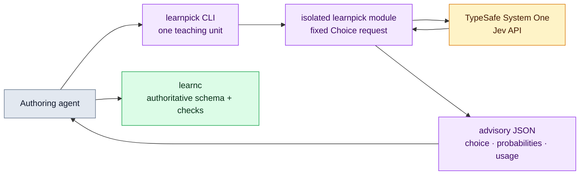

# `learnpick` adviser

`learnpick` is an optional agent-facing companion that recommends how one
teaching unit should be represented in a lesson. It makes one TypeSafe System
One Choice request and returns one of `markdown`, `code`, `diff`, or
`multiple_choice`, together with the model's confidence and complete
probability distribution.

The result is advice, not part of the lesson contract. `learnc schema` and
`learnc check` remain authoritative, and an unavailable adviser must never
prevent an agent from authoring or compiling a lesson.

## Use it

Set the TypeSafe API key and pass exactly one concise teaching-unit description:

```sh
export TYPESAFE_API_KEY=...
learnpick "Show the final parser implementation"
printf '%s\n' "Explain why this patch fixes the race" | learnpick -
```

Output is JSON by default. Pass `--text` or `-t` for a short human-readable
answer, and use `learnpick --help` for the current machine-readable CLI
contract.

The default request uses `https://api.typesafe.ai/v1/systemone`, model
`jev-latest`, and a ten-second total timeout. `TYPESAFE_BASE_URL` and
`TYPESAFE_DEFAULT_MODEL` override the endpoint base and model respectively.
There are no command-line credential flags, so the API key cannot accidentally
appear in process arguments or output.

A successful JSON response has this shape:

```json
{
  "ok": true,
  "source_schema_version": "2.1.0",
  "model": "jev-1.13.0",
  "block_type": "code",
  "confidence": 0.91,
  "probabilities": {
    "markdown": 0.04,
    "code": 0.91,
    "diff": 0.04,
    "multiple_choice": 0.01
  },
  "usage": {
    "input_tokens": 210,
    "output_tokens": 28
  }
}
```

Failures use the same `{ "ok": false, "diagnostics": [...] }` envelope as
`learnc` and exit nonzero. (`learn` reports startup failures differently, as
`{ "status": "error", "error": {...} }`.) A network, credential, or response error means
the caller should choose a block manually; it does not invalidate lesson
source.

## Request boundary

One invocation performs one synchronous HTTP request with one Choice question.
The teaching-unit text is sent as structured `state`; the four block types and
their semantic criteria are fixed by the binary. The API key is sent only in
the bearer authorization header. The response projection preserves the
resolved model name, selected block, confidence, all probabilities, and token
usage.



Purple is the disposable advisory path, amber is the external API, and green
is the authoritative compiler path.

## Isolation invariant

The implementation intentionally is not a core compiler/runtime feature:

- [`src/lib.rs`](../src/lib.rs) exposes [`src/learnpick.rs`](../src/learnpick.rs),
  and [`src/bin/learnpick.rs`](../src/bin/learnpick.rs) is its CLI entry point.
- [`src/learnpick/`](../src/learnpick) contains the private HTTP client.
- `learnc`, `learn`, and every compiler, runtime, source, artifact, repository,
  and other core module neither import nor call `learnpick`.
- Dependencies flow from `learnpick` toward reusable core output helpers, never
  from the compiler or runtime toward the adviser.

This makes removal straightforward: delete the library declaration, binary
declaration, and picker source paths, then remove its dependency and
documentation. No lesson source, artifact, compiler, runtime, or frontend
migration is involved.

## Intentional limits

- The input is a description, not lesson JSON and not a request to generate a
  block.
- The four v1 outcomes are fixed; source-kind selection is still manual.
- There is no retry loop, cache, batching, confidence threshold, or fallback
  model.
- The binary never invokes `learnc`, edits lesson source, compiles an artifact,
  or starts `learn`.
